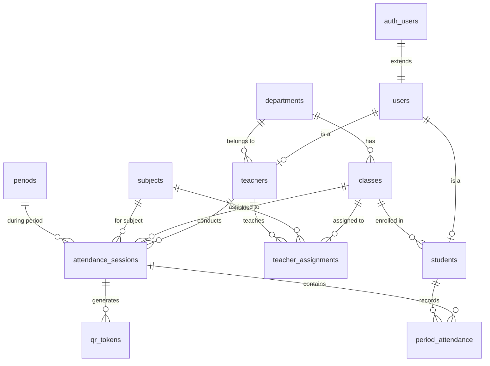
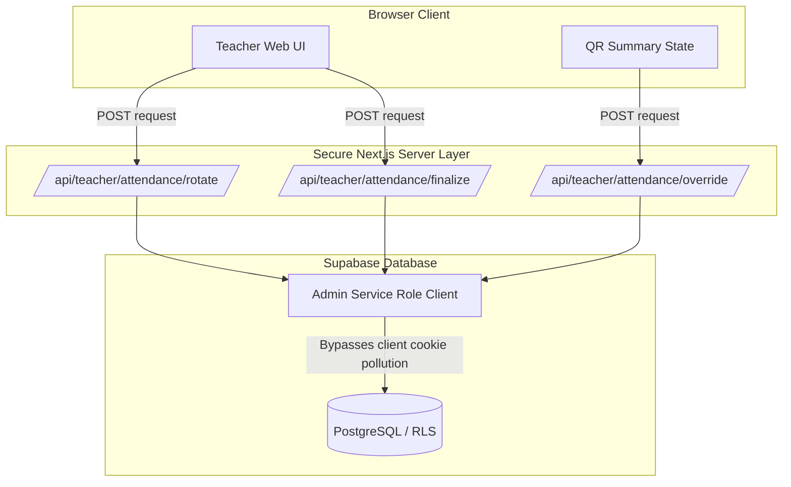

# Comprehensive Forensic Diagnostic Report: Multi-Tab / Multi-Portal Attendance System

**Investigation Type:** READ-ONLY Forensic Investigation  
**Status:** COMPLETE  
**Scope:** Admin Portal, Teacher Portal, Multiple Teacher Accounts, Flutter Student Application, Supabase Auth, QR Session Lifecycle, Token Rotation & Validation, `period_attendance` RLS, and Concurrency.

---

## 1. Executive Summary

A comprehensive, read-only forensic investigation was conducted across the Next.js web application (`e:\Admin-Teacher`), the Flutter mobile application (`e:\Attendance`), and the live Supabase database instance (`knkoihgyfjoaxznelrjr`).

The investigation confirmed that the system functions correctly in single-portal / single-session isolation because all client-side authentication tokens, session identifiers, and database RLS checks match expectations.

The failure mode observed when multiple portals or tabs are opened simultaneously is **not** a database corruption or a Flutter logic flaw; it is caused by a **fundamental session-collision architecture in the browser client combined with client-side direct table operations subjected to Row-Level Security (RLS)**:

1. **Browser Cookie Namespace Collision:** Both the Admin and Teacher portals run under the same origin (`localhost:3000` or the same domain) and utilize `@supabase/ssr` with identical cookie storage (`sb-<project-ref>-auth-token`). Logging in as Admin in Tab A **immediately overwrites** the authentication cookies used by the Teacher portal in Tab B.
2. **Client-Side RLS Rejection (HTTP 403 / Postgres 42501):** When the Teacher portal in Tab B initiates QR rotation (`qr_tokens`), roster updates (`period_attendance`), or session finalization, it makes direct database requests using `createClient()` (the browser client). Because the ambient browser cookie now holds the Admin's JWT, Supabase evaluates RLS with `auth.uid() = Admin ID` (`role = 'admin'`). 
   - `period_attendance` has NO admin INSERT policy.
   - `qr_tokens` requires `attendance_sessions.teacher_id = auth.uid()`, which fails because the session belongs to the teacher, not the admin.
3. **Silent UI Desynchronization:** 
   - When `handleRotate()` fails due to 403, it catches the error silently. The React UI displays a new QR code that was **never inserted into Supabase**. When the student scans it, Flutter receives 0 rows and reports *"QR code is expired or invalid"*.
   - When `handleOverride()` in `qr-summary-state.tsx` fails due to 403, the catch block attempts a rollback with `status: s.status`, which is already mutated to the optimistic state (`newStatus`). The UI displays "Present" with a green badge while the database write was rejected.
   - When the teacher clicks "Done", the manual override is absent from the database, causing the student's dashboard to reflect an absent or missing record.

---

## 2. Categorized Findings Summary

| Category | Status | Summary |
| :--- | :--- | :--- |
| **A. Auth / Session Architecture** | **[CONFIRMED]** | Single-origin cookie sharing overwrites tokens between tabs of different accounts/roles. |
| **B. QR Token Lifecycle** | **[CONFIRMED]** | Silent 403 failure in `handleRotate()` leaves unpersisted tokens displayed on teacher screen. |
| **C. Database RLS Authorization** | **[CONFIRMED]** | Admin JWT has zero write permissions on `period_attendance` and `qr_tokens`. |
| **D. Frontend State Synchronization** | **[CONFIRMED]** | Buggy catch block in `qr-summary-state.tsx` prevents rollback on failed manual override. |
| **E. Error Handling & Reporting** | **[CONFIRMED]** | Flutter collapses all token lookup misses into a generic "QR expired/invalid" message. |
| **F. Multi-Teacher (Separate Devices)** | **[CONFIRMED]** | Fully isolated and safe. Schema and RLS properly scope by `teacher_id` and `session_id`. |
| **G. Multi-Teacher (Same Browser)** | **[CONFIRMED]** | Collides identically to Admin+Teacher due to shared browser cookie jar. |
| **H. Single-Account Multi-Tab** | **[RULED OUT]** | Same-account multi-tab is supported by Supabase; no single-session restriction needed. |

---

## 3. Confirmed Root Causes

### 1. [CONFIRMED] Cross-Tab Cookie Overwrite Between Distinct Roles/Accounts
- **Mechanism:** `@supabase/ssr` (`createBrowserClient` in `lib/supabase/client.ts`) stores authentication sessions in HTTP cookies (`sb-<project-ref>-auth-token`). In web browsers, cookies are scoped strictly to the origin (protocol, domain, and port).
- **Impact:** When an Admin logs into Tab A and a Teacher logs into Tab B on the same origin:
  1. Tab A signs in as Admin $\rightarrow$ Cookie becomes Admin JWT.
  2. Tab B has Teacher state in React memory, but any outgoing `fetch` or Supabase browser client call sends the Admin JWT in the `Authorization` header.
  3. If Tab B calls `signInWithPassword` as Teacher $\rightarrow$ Cookie becomes Teacher JWT $\rightarrow$ Tab A's next action sends Teacher JWT and fails admin role checks.

### 2. [CONFIRMED] Postgres RLS Rejection: Code 42501 on `period_attendance`
- **Mechanism:** In the database `pg_policies`, `period_attendance` has the following write policies:
  - `student_insert_period_attendance`: `WITH CHECK (student_id = auth.uid())`
  - `student_update_own_period_attendance`: `USING (student_id = auth.uid())`
  - `teacher_manage_period_attendance`: `USING (EXISTS (SELECT 1 FROM users WHERE users.id = auth.uid() AND users.role = 'teacher'))`
- **Impact:** When Tab B (Teacher Portal) performs an INSERT or UPDATE on `period_attendance` while the active browser cookie holds the Admin session, `auth.uid()` belongs to the Admin (`users.role = 'admin'`).
  - `teacher_manage_period_attendance` evaluates to `FALSE`.
  - `student_insert_period_attendance` evaluates to `FALSE`.
  - PostgreSQL rejects the statement: `ERROR 42501: new row violates row-level security policy for table "period_attendance"`.

### 3. [CONFIRMED] Phantom QR Code Display Due to Silent 403 Rejection
- **Mechanism:** In `app/teacher/qr-attendance/page.tsx`, `handleRotate()` executes:
  ```typescript
  const newToken = crypto.randomUUID()
  const expiry = new Date(Date.now() + 15000).toISOString()
  setCurrentQrToken(newToken) // <--- React state updated immediately

  await supabase.from("qr_tokens").update({ is_used: true }).eq("session_id", activeSessionId)...
  await supabase.from("attendance_sessions").update({ current_qr_token: newToken, ... }).eq("id", activeSessionId)
  await supabase.from("qr_tokens").insert({ session_id: activeSessionId, token: newToken, expires_at: expiry, is_used: false })
  ```
- **Impact:** When the Admin session is active in the cookie jar, `teacher_manage_qr_tokens` rejects the INSERT/UPDATE with HTTP 403.
  - The `catch (err)` block in `handleRotate()` only logs `console.error("Failed to rotate QR", err)`.
  - The teacher's screen continues to display the QR code for `newToken`.
  - The student scans this QR code in Flutter.
  - Flutter executes:
    ```dart
    final tokenRows = await supabase.from('qr_tokens').select().eq('token', scannedToken)...
    ```
  - Because the token was never inserted into `qr_tokens`, `tokenRows` is empty.
  - Flutter displays: `"QR code is expired or invalid. Please wait for the next rotation."`
  - When the 15s timer rotates again, it fails again, producing an endless loop of invalid QR codes.

### 4. [CONFIRMED] Broken State Rollback on Manual Override in `qr-summary-state.tsx`
- **Mechanism:** In `components/teacher/qr-summary-state.tsx` (lines 122–171):
  ```typescript
  // 1. Optimistic update
  setStudents((prev) =>
    prev.map((s) => (s.id === studentId ? { ...s, status: newStatus } : s))
  )

  try {
    const supabase = createClient()
    // ... Supabase write fails with 403 ...
  } catch (err) {
    console.error(err)
    // 2. Failed rollback attempt:
    setStudents((prev) =>
      prev.map((s) => (s.id === studentId ? { ...s, status: s.status } : s))
    )
    toast.error("Failed to update status")
  }
  ```
- **Impact:** `s.status` inside `prev` was **already mutated** to `newStatus` during the optimistic update in Step 1.
  - Resetting `status: s.status` re-assigns `newStatus`.
  - The UI continues to show the student as **Present** with a green badge.
  - The teacher sees the error toast but assumes the UI reflects the actual state and clicks "Done".
  - The database was never updated, so the student's app/dashboard displays "Absent".

---

## 4. Ruled-Out Causes

1. **[RULED OUT] Database Multi-Teacher Incompatibility:**
   - The database schema strictly isolates sessions by `attendance_sessions.id`, `teacher_id`, `class_id`, `subject_id`, and `session_id`.
   - When different teachers operate on different devices or browser profiles, there is zero cross-contamination.
2. **[RULED OUT] Flutter Face Verification / Recognition Engine Failure:**
   - As confirmed by testing and code inspection, face embeddings, threshold checks, and network retry logic operate as intended.
3. **[RULED OUT] Realtime Subscription Leakage:**
   - Realtime channel subscriptions (`channel('attendance_${activeSessionId}')`) are strictly filtered by `session_id`.
4. **[RULED OUT] Single-Session Restriction Requirement for Same Account:**
   - There is no technical limitation preventing a single teacher or admin account from having multiple tabs open; Supabase session tokens are shared and valid across multiple tabs of the same account.

---

## 5. Evidence from Source Code

### A. Next.js Supabase Client Helpers
- `lib/supabase/client.ts` (lines 1–8):
  ```typescript
  import { createBrowserClient } from "@supabase/ssr";

  export function createClient() {
    return createBrowserClient(
      process.env.NEXT_PUBLIC_SUPABASE_URL!,
      process.env.NEXT_PUBLIC_SUPABASE_ANON_KEY!
    );
  }
  ```
  *Analysis:* Creates a browser client tied to document cookies. All tabs in the same browser share this exact client storage.

- `lib/supabase/middleware.ts` (lines 32–78):
  ```typescript
  const { data: { user } } = await supabase.auth.getUser();
  // If accessing teacher portal, checks teachers table for user.id
  // If accessing admin portal, checks users table for role === "admin"
  ```
  *Analysis:* If Tab A (Admin) logs in, the cookie becomes Admin. If Tab B navigates to `/teacher/...`, the middleware checks if the Admin's `user.id` is in the `teachers` table. If not found or inactive, it redirects to `/login?error=disabled` or invalidates cookies.

### B. Teacher QR Attendance Page State & Direct Database Writes
- `app/teacher/qr-attendance/page.tsx` (lines 44–48):
  ```typescript
  const { data: { subscription } } = supabase.auth.onAuthStateChange((_event, session) => {
    sessionRef.current = session
  })
  ```
  *Analysis:* When another tab logs in, `onAuthStateChange` immediately updates `sessionRef.current` in the teacher tab to the new user's session.
- `app/teacher/qr-attendance/page.tsx` (lines 418–423, 449–468, 506–520, 610–660):
  *Analysis:* `handleStart()`, `handleRotate()`, `handleFinalize()`, and `onDone()` all perform direct client-side table writes to `attendance_sessions`, `qr_tokens`, and `period_attendance` using the browser client `createClient()` rather than a server route.

### C. Flutter QR Scanner Validation Flow
- `e:\Attendance\lib\screens\attendance\qr_scanner_screen.dart` (lines 192–206):
  ```dart
  final tokenRows = await supabase
      .from('qr_tokens')
      .select()
      .eq('token', scannedToken)
      .eq('is_used', false)
      .gt('expires_at', DateTime.now().toUtc().toIso8601String())
      .limit(1);

  if (tokenRows.isEmpty) {
    _showError(
      'QR code is expired or invalid. Please wait for the next rotation.',
    );
    return;
  }
  ```
  *Analysis:* If the token was not written to Supabase due to a 403 error on the teacher side, `tokenRows` is empty. Flutter displays the generic error without differentiating between a network failure, an unwritten token, or a genuinely expired token.

---

## 6. Evidence from Actual Supabase Schema and RLS Policies

Direct inspection of `pg_policies` from PostgreSQL:

### `period_attendance` RLS Policies
```sql
-- 1. Admin Read Only (NO Admin Insert/Update!)
CREATE POLICY "admin_read_period_attendance" ON "period_attendance"
FOR SELECT TO public
USING (auth.uid() IN (SELECT users.id FROM users WHERE users.role = 'admin'));

-- 2. Student Insert Own Record
CREATE POLICY "student_insert_period_attendance" ON "period_attendance"
FOR INSERT TO public
WITH CHECK (student_id = auth.uid());

-- 3. Student Read Own Record
CREATE POLICY "student_read_own_period_attendance" ON "period_attendance"
FOR SELECT TO public
USING (student_id = auth.uid());

-- 4. Student Update Own Record
CREATE POLICY "student_update_own_period_attendance" ON "period_attendance"
FOR UPDATE TO public
USING (student_id = auth.uid())
WITH CHECK (student_id = auth.uid());

-- 5. Teacher Manage (ALL)
CREATE POLICY "teacher_manage_period_attendance" ON "period_attendance"
FOR ALL TO public
USING (EXISTS (SELECT 1 FROM users WHERE users.id = auth.uid() AND users.role = 'teacher'));

-- 6. Teacher Read
CREATE POLICY "teacher_read_period_attendance" ON "period_attendance"
FOR SELECT TO public
USING (EXISTS (SELECT 1 FROM attendance_sessions s WHERE s.id = period_attendance.session_id AND s.teacher_id = auth.uid()));
```

### `qr_tokens` RLS Policies
```sql
-- 1. Student Read Token
CREATE POLICY "student_read_qr_tokens" ON "qr_tokens"
FOR SELECT TO public
USING (true);

-- 2. Teacher Manage Tokens
CREATE POLICY "teacher_manage_qr_tokens" ON "qr_tokens"
FOR ALL TO public
USING (EXISTS (
  SELECT 1 FROM attendance_sessions
  WHERE attendance_sessions.id = qr_tokens.session_id
    AND attendance_sessions.teacher_id = auth.uid()
));
```

### Key RLS Diagnostic Insights:
1. When an Admin JWT is used, `teacher_manage_period_attendance` evaluates `users.role = 'teacher'` $\rightarrow$ **FALSE**.
2. There is no policy permitting Admins to insert or update `period_attendance`.
3. When an Admin JWT is used on `qr_tokens`, `attendance_sessions.teacher_id = auth.uid()` evaluates `Teacher UUID = Admin UUID` $\rightarrow$ **FALSE**.
4. Both tables strictly reject any write operations coming from a contaminated Admin browser session.

---

## 7. Detailed Lifecycle and Failure Trace

```mermaid
sequenceDiagram
    autonumber
    actor Admin as Admin (Tab A)
    actor Teacher as Teacher (Tab B)
    actor Student as Student (Flutter App)
    participant Browser as Browser Cookie Jar
    participant API as Next.js Server / Client
    participant DB as Supabase PostgreSQL

    Teacher->>Browser: Login as Teacher (Cookie = Teacher JWT)
    Teacher->>DB: Start Attendance Session (session_id = S1, teacher_id = T1)
    DB-->>Teacher: Session S1 Active

    Admin->>Browser: Login as Admin (Tab A)
    Note over Browser: Cookie OVERWRITTEN with Admin JWT!

    Note over Teacher: 15s QR Rotation Triggered in Tab B
    Teacher->>Teacher: setCurrentQrToken(UUID_2) [React State Updated]
    Teacher->>DB: INSERT INTO qr_tokens (token = UUID_2, session_id = S1) [Sends Admin JWT]
    DB-->>Teacher: HTTP 403 Forbidden (RLS 42501: teacher_id != Admin UID)
    Note over Teacher: Error caught silently; UI still shows UUID_2 QR Code

    Student->>Student: Scans UUID_2 QR Code
    Student->>DB: SELECT FROM qr_tokens WHERE token = UUID_2
    DB-->>Student: [] (0 Rows Found)
    Student-->>Student: "QR code is expired or invalid. Please wait for next rotation."

    Note over Teacher: Session Ends -> Teacher opens Review Roster
    Teacher->>Teacher: Manual Override: Mark Student X Present
    Note over Teacher: Optimistic UI updates Student X to Present
    Teacher->>DB: UPDATE/INSERT period_attendance (student_id = X, session_id = S1) [Sends Admin JWT]
    DB-->>Teacher: HTTP 403 Forbidden (RLS 42501: Admin role cannot write)
    Note over Teacher: Catch block fails rollback; UI stays Present; Toast: "Failed to update status"
    Teacher->>Teacher: Clicks "Finalize Session"
    Student->>DB: Student checks Dashboard for Attendance
    DB-->>Student: No record / Absent
```

---

## 8. Database Relationship Map



### Table Details Summary:
- **`auth.users`**: Root authentication table managed by Supabase GoTrue.
- **`public.users`**: `id` (PK $\rightarrow$ `auth.users.id` ON DELETE CASCADE), `email`, `role` ('admin' | 'teacher' | 'student').
- **`public.teachers`**: `id` (PK $\rightarrow$ `users.id`), `teacher_id_code` (UNIQUE), `is_active`.
- **`public.students`**: `id` (PK $\rightarrow$ `users.id`), `roll_number` (UNIQUE), `class_id`, `face_registered`, `is_approved`.
- **`public.attendance_sessions`**: `id` (PK), `teacher_id` ($\rightarrow$ `teachers.id`), `class_id`, `subject_id`, `period_id`, `status` ('active' | 'reviewing' | 'finalized'), `opened_at`, `finalized_at`.
- **`public.qr_tokens`**: `id` (PK), `session_id` ($\rightarrow$ `attendance_sessions.id`), `token` (UNIQUE), `expires_at`, `is_used`.
- **`public.period_attendance`**: `id` (PK), `session_id` ($\rightarrow$ `attendance_sessions.id`), `student_id` ($\rightarrow$ `students.id`), `status` ('pending' | 'present' | 'absent' | 'failed'), `face_verified`, `override_by_teacher`, `overridden_by` ($\rightarrow$ `teachers.id`), UNIQUE (`session_id`, `student_id`).

---

## 9. Direct Answers to the 10 Specific Questions

### 1. Why does one portal work correctly while two portals/tabs can interfere?
When only one portal is active, the browser's cookie jar holds that portal's authenticated JWT (e.g., Teacher JWT). All browser client calls (`createClient()`) and Next.js middleware calls use that single valid token.  
When a second portal (e.g. Admin) logs in in another tab of the same browser origin, `signInWithPassword` overwrites the shared browser cookies (`sb-<project-ref>-auth-token`) with the Admin JWT. The Teacher portal tab now makes direct Supabase client calls using the Admin JWT, causing RLS policies on `qr_tokens` and `period_attendance` to reject all writes with HTTP 403 / 42501.

### 2. Why does logging out of one portal appear to affect the other?
Browser cookies and Supabase Auth storage are shared across all tabs of the same origin. Logging out calls `supabase.auth.signOut()`, which clears the shared cookies and revokes the session on the Supabase Auth server. Any other tab on that origin immediately loses its session.

### 3. Why does QR validation sometimes say expired/invalid even after QR rotation?
When the Teacher portal attempts to rotate the QR code (`handleRotate`), the database `INSERT` into `qr_tokens` fails with 403 due to session contamination. `handleRotate` catches the error silently without rolling back React state, and the teacher's screen renders the newly generated QR token. When the student scans it, Flutter queries `qr_tokens` in Supabase, finds 0 rows, and displays `"QR code is expired or invalid. Please wait for the next rotation."`

### 4. Why does `period_attendance` return 403 / 42501?
`period_attendance` RLS allows INSERT/UPDATE only for students (`student_id = auth.uid()`) and teachers (`users.role = 'teacher'`). There is NO policy granting INSERT/UPDATE access to `role = 'admin'`. When the browser session is contaminated with the Admin's JWT, Supabase sees `auth.uid()` with `role = 'admin'`. The RLS engine rejects the operation with Postgres error `42501`.

### 5. Why can manual attendance show "failed to update" while the UI changes?
In `components/teacher/qr-summary-state.tsx`, `handleOverride()` performs an optimistic UI update (`setStudents(...)`) before calling Supabase. When the Supabase write fails with 403, the `catch` block executes:
`setStudents((prev) => prev.map((s) => s.id === studentId ? { ...s, status: s.status } : s))`.  
Because `s.status` in `prev` was already set to `newStatus` by the optimistic update, this statement re-assigns `newStatus` rather than the previous state. The UI permanently displays "Present", even though the toast shows "Failed to update status" and the database write failed.

### 6. Why can the student's dashboard fail to reflect the attendance?
Because the manual override write to `period_attendance` failed due to the 403 error and was never persisted in the database. When the teacher clicks "Done", the session is finalized, but the student's record in `period_attendance` remains `absent` or missing. The student's dashboard queries the database directly and finds no `present` record.

### 7. Can Admin + Teacher accounts coexist in separate tabs with the current browser Supabase architecture?
**NO.** Under standard browser origin rules, cookies and localStorage are shared across all tabs of `localhost:3000` (or the domain). `createBrowserClient` uses a single cookie namespace per project.

### 8. Can two different Teacher accounts operate simultaneously?
- **In separate browsers / profiles / devices:** **YES, 100% supported**. The database schema, session IDs, teacher IDs, and RLS policies completely isolate sessions.
- **In two tabs of the same browser window:** **NO**, for the exact same cookie-overwrite reason.

### 9. Should same-account multiple tabs be restricted to one active session, or is that unnecessary?
It is **UNNECESSARY** to restrict the same account to one session. Supabase handles multi-tab synchronization for the *same* account cleanly. The issue is strictly cross-account collisions sharing one cookie store.

### 10. What is the safest Phase 2 fix architecture that preserves all currently working behavior?
1. **Server API Route Architecture for Teacher Writes:** Move all critical teacher attendance writes (`start_session`, `rotate_qr`, `finalize_session`, `manual_override`) to secure Next.js Server API Routes (`/api/teacher/...`) using `createAdminClient()` or verified server session, with server-side validation.
2. **Fix Optimistic State Rollback in `qr-summary-state.tsx`:** Store previous student state before optimistic update and restore previous state on error.
3. **Add Explicit Rotation Error Handling in `page.tsx`:** If QR rotation fails, display a clear UI warning to the teacher and do not display the unpersisted token.
4. **Refine Flutter Error Categorization:** Differentiate between network failure, unwritten token, and expired session in Flutter.
5. **Environment & Multi-Account Isolation:** For local multi-portal testing on the same machine, use distinct browser profiles (or separate subdomains / cookie namespaces for Admin vs Teacher).

---

## 10. Recommended Phase 2 Architecture & Action Plan



1. **Move Mutations to Server Routes:**
   - Create `/api/teacher/attendance/rotate`
   - Create `/api/teacher/attendance/override`
   - Create `/api/teacher/attendance/finalize`
   - These routes verify the teacher's session on the server or authenticate via server credentials, performing database mutations via `supabaseAdmin`. This completely isolates critical attendance writes from client-side cookie pollution.
2. **Correct Frontend State Rollbacks:**
   - In `components/teacher/qr-summary-state.tsx`, capture `const previousStatus = students.find(s => s.id === studentId)?.status` before mutating, and roll back to `previousStatus` in the `catch` block.
3. **Surface Rotation Failures:**
   - In `app/teacher/qr-attendance/page.tsx`, if `handleRotate()` fails, display a warning banner to the teacher and pause the rotation countdown until connectivity or authentication is restored.
4. **Distinguish Flutter Errors:**
   - In `qr_scanner_screen.dart`, verify whether `sessionRows` is active before evaluating `tokenRows`, providing accurate messages for session expiration vs token rotation delays.

---
*Report generated in READ-ONLY mode. No code, database schemas, or RLS policies were modified.*
