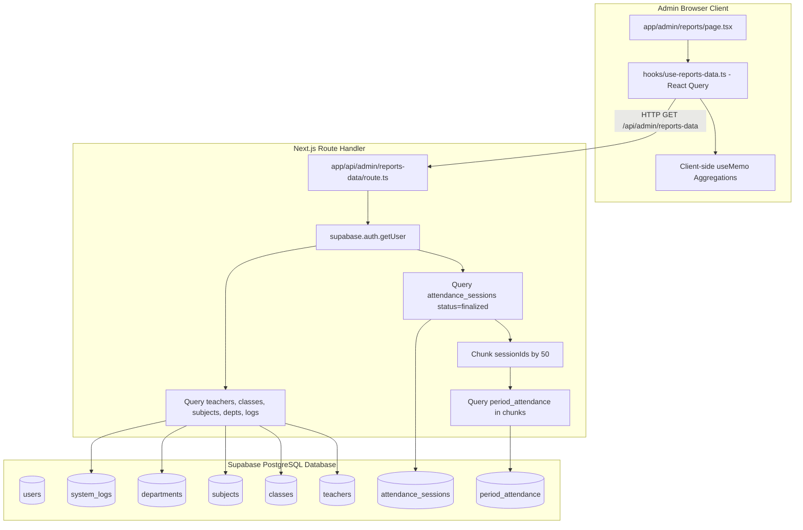
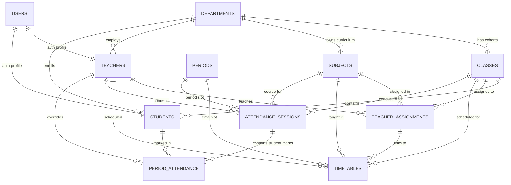
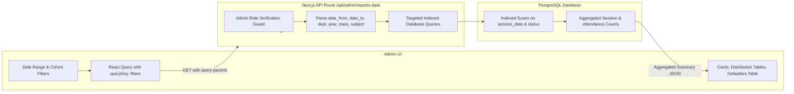

# PHASE 3 — READ-ONLY ADMIN REPORTS & ANALYTICS AUDIT
## Database Truth, Calculation Specification & Reporting Architecture Investigation

**Document ID:** `PHASE_3_REPORTS_ANALYTICS_AUDIT.md`  
**Investigation Mode:** Strictly Read-Only (Zero modifications made to code, schemas, policies, triggers, or data)  
**Database Evaluated:** Supabase PostgreSQL (`factor-attendance` / `knkoihgyfjoaxznelrjr`)  
**Target Codebase Paths:**  
- UI Layer: [`app/admin/reports/page.tsx`](file:///e:/Admin-Teacher/app/admin/reports/page.tsx)  
- API Layer: [`app/api/admin/reports-data/route.ts`](file:///e:/Admin-Teacher/app/api/admin/reports-data/route.ts)  
- Hook Layer: [`hooks/use-reports-data.ts`](file:///e:/Admin-Teacher/hooks/use-reports-data.ts)  

---

## 1. Executive Summary

This forensic audit investigates the database schema, data lineage, security constraints, and mathematical calculations powering the Admin Reports and Analytics module of the Factor Attendance system.

### Key Forensic Discoveries:
1. **The "Predictive Analytics" Mystery Resolved:**  
   The label *"Predictive Analytics"* appearing in the Admin Status Cards is **not** an AI feature or predictive algorithm label. It is the literal name of an academic course/subject (`Predictive Analytics`, code `PA`, belonging to the CSD department) taught to 4th Year CSE-A. Because that subject had 5 sessions with 5 present marks (100% attendance), the frontend sorted it to rank #1 and displayed the subject name inside Card #2 (*Top Attendance*).
2. **Teacher "Completion Rate" Formula is Mathematically Invalid:**  
   The current frontend calculates `rate = Math.min(100, Math.round((sessions / assigned) * 100))`, where `assigned` is the count of rows in `teacher_assignments` (assigned course pairs) and `sessions` is cumulative conducted sessions. A teacher with 3 course assignments who conducted 444 sessions gets `444 / 3 = 14,800%` (clamped to 100%), while a teacher who conducted 2 sessions for 3 assignments gets 67%. This is a flawed metric because `teacher_assignments` is not a quota of expected periods.
3. **Cohort Dimension Ambiguity (Why "CSD-A" / "CSE-A" is insufficient):**  
   In the database, multiple distinct classes share the same name and section across different academic years (e.g., `1st Year CSE-A`, `2nd Year CSE-A`, and `4th Year CSE-A`). Displaying `CSE-A` alone obscures the academic year.
4. **No Explicit Test/Production Discriminator:**  
   The database contains 449 finalized sessions and 583 period attendance records. Many sessions were created during automated testing, bulk-backfill operations, or historical testing (e.g., 61 sessions on August 20, 2026; 53 on August 21, 2026; 11 sessions with 0 attendance marks for unpopulated cohorts). There is **no boolean or metadata column** distinguishing test sessions from production sessions.
5. **Decoupled Timetable vs. Session Model:**  
   `attendance_sessions` does **not** have a foreign key to `timetables`. Sessions directly store `teacher_id`, `subject_id`, `class_id`, `period_id`, and `session_date`. Therefore, deleting or modifying a timetable slot does **not** delete, corrupt, or alter historical attendance sessions.
6. **Scalability Bottleneck in API Architecture:**  
   [`app/api/admin/reports-data/route.ts`](file:///e:/Admin-Teacher/app/api/admin/reports-data/route.ts) fetches all finalized sessions across all time, chunks their IDs in batches of 50 to query `period_attendance`, and sends all raw records to the browser. As the semester grows to tens of thousands of session rows, this will exceed URL query limits, memory thresholds, and cause UI degradation.

---

## 2. Current Reports Architecture



### Execution Flow:
1. `ReportsPage` mounts and invokes `useReportsData()`.
2. `fetchReportsData()` sends `GET /api/admin/reports-data`.
3. The route handler initializes a server client using the user's cookies/Bearer token (`createClient()`).
4. It calls `supabase.auth.getUser()`. If no user session exists, returns 401.
5. In parallel (`Promise.all`), it executes queries for `teachers`, `attendance_sessions` (where `status = 'finalized'`), `teacher_assignments`, `system_logs` (limit 100), `departments`, `classes`, and `subjects`.
6. Extracts `sessionIds` from all finalized sessions.
7. Divides `sessionIds` into batches of 50 (`CHUNK_SIZE = 50`) and executes parallel queries to `period_attendance` where `session_id IN (chunk)` and `status IN ('present', 'absent')`.
8. Maps `system_logs.performed_by` to user names via a secondary `users` query.
9. Returns the unaggregated payload containing all raw sessions, attendance records, teachers, classes, and subjects.
10. `ReportsPage` runs client-side `useMemo` hooks over the entire dataset to compute filter lists, teacher completion rates, subject cohort averages, department breakdowns, and below-75% student lists.

---

## 3. Database Schema Findings

Forensic inspection of the Supabase PostgreSQL database (`public` schema) reveals the following structural definitions:

### A. Core Entity Tables

#### 1. `departments`
- **Primary Key:** `id` (`uuid`, default `gen_random_uuid()`)
- **Columns:** `id`, `name` (`text`, NOT NULL), `code` (`text`, NOT NULL, UNIQUE), `created_at` (`timestamptz`)
- **Foreign Keys:** None
- **Soft Delete:** None (Hard-delete only)
- **Real Records in DB:** 3 departments (`CSE`, `CSD`, `ECE`)

#### 2. `classes`
- **Primary Key:** `id` (`uuid`, default `gen_random_uuid()`)
- **Columns:** `id`, `name` (`text`, NOT NULL), `section` (`text`, NOT NULL), `year` (`text`, NOT NULL), `department_id` (`uuid`, FK -> `departments.id` ON DELETE CASCADE), `created_at` (`timestamptz`)
- **Unique Constraints:** `(department_id, name, section, year)`
- **Foreign Keys:** `department_id` -> `departments.id`
- **Soft Delete:** None
- **Real Records in DB:** 6 classes:
  - `1st Year CSD-A` (Dept: CSD)
  - `1st Year CSE-A` (Dept: CSE)
  - `1st Year CSE-B` (Dept: CSE)
  - `1st Year ECE-A` (Dept: ECE)
  - `2nd Year CSE-A` (Dept: CSE)
  - `4th Year CSE-A` (Dept: CSE)

#### 3. `subjects`
- **Primary Key:** `id` (`uuid`, default `gen_random_uuid()`)
- **Columns:** `id`, `name` (`text`, NOT NULL), `code` (`text`, NOT NULL, UNIQUE), `department_id` (`uuid`, FK -> `departments.id` ON DELETE CASCADE), `created_at` (`timestamptz`)
- **Foreign Keys:** `department_id` -> `departments.id`
- **Soft Delete:** None
- **Real Records in DB:** 5 subjects:
  - `Computer Networks` (Code: `CN`, Dept: CSD)
  - `Machine Learning` (Code: `ML`, Dept: CSE)
  - `Operating Systems` (Code: `OS`, Dept: CSE)
  - `Predictive Analytics` (Code: `PA`, Dept: CSD)
  - `Software Engineering` (Code: `SE`, Dept: CSE)

#### 4. `periods`
- **Primary Key:** `id` (`uuid`, default `gen_random_uuid()`)
- **Columns:** `id`, `period_number` (`integer`, NOT NULL), `start_time` (`text`, NOT NULL), `end_time` (`text`, NOT NULL), `created_at` (`timestamptz`)
- **Real Records in DB:** 5 periods (Periods 1 through 5)

#### 5. `users`
- **Primary Key:** `id` (`uuid`, references `auth.users.id` ON DELETE CASCADE)
- **Columns:** `id`, `email` (`text`, NOT NULL, UNIQUE), `full_name` (`text`, NOT NULL), `role` (`text`, NOT NULL: `'admin' | 'teacher' | 'student'`), `must_change_password` (`boolean`), `created_at` (`timestamptz`), `profile_photo_url` (`text`), `contact_email` (`text`)
- **Real Records in DB:** 13 users (1 Admin, 6 Teachers, 6 Students)

#### 6. `teachers`
- **Primary Key:** `id` (`uuid`, references `users.id` ON DELETE CASCADE)
- **Columns:** `id`, `teacher_id_code` (`text`, NOT NULL, UNIQUE), `department_id` (`uuid`, FK -> `departments.id`), `is_active` (`boolean`, default `true`), `title` (`text`, NOT NULL, default `'Mr'`), `created_at` (`timestamptz`)
- **Real Records in DB:** 6 teachers:
  - `TCH006`: Mrs. Priyanka (CSD)
  - `TCH013`: Mr. Anil Kumar (CSD)
  - `TCHO10`: Mr. Rakesh (CSD)
  - `TCHO15`: Mr. Venu (ECE)
  - `TCHO18`: Mr. Ram (CSE)
  - `TCHOO7`: Mrs. Devi (CSE)

#### 7. `students`
- **Primary Key:** `id` (`uuid`, references `users.id` ON DELETE CASCADE)
- **Columns:** `id`, `roll_number` (`varchar`, NOT NULL, UNIQUE), `department_id` (`uuid`, FK -> `departments.id`), `class_id` (`uuid`, FK -> `classes.id`), `year` (`text`, NOT NULL), `created_by` (`uuid`, FK -> `teachers.id`), `is_active` (`boolean`, default `true`), `is_approved` (`boolean`, default `false`), `face_registered` (`boolean`, default `false`), `is_rejected` (`boolean`, default `false`), `verification_threshold` (`float`), `face_embedding` (`jsonb`), embeddings & template fields, `created_at` (`timestamptz`)
- **Real Records in DB:** 6 students:
  - `227Z1A6753`: SURESH (2nd Year CSE-A)
  - `227Z1A6755`: RAHUL (4th Year CSE-A, approved)
  - `227Z1A6756`: RAVI (4th Year CSE-A, approved)
  - `227Z1A6757`: MADHAVR (1st Year CSE-A)
  - `227Z1A6759`: SURESH (1st Year CSE-A)
  - `227Z1A6775`: SHASHANK (4th Year CSE-A, approved)

---

### B. Scheduling & Transactional Tables

#### 8. `teacher_assignments`
- **Primary Key:** `id` (`uuid`, default `gen_random_uuid()`)
- **Columns:** `id`, `teacher_id` (`uuid`, FK -> `teachers.id` ON DELETE CASCADE), `subject_id` (`uuid`, FK -> `subjects.id` ON DELETE CASCADE), `class_id` (`uuid`, FK -> `classes.id` ON DELETE CASCADE), `year` (`text`), `assigned_at` (`timestamptz`)
- **Unique Constraint:** `(teacher_id, subject_id, class_id, year)`
- **Real Records in DB:** 6 assignments:
  - Venu -> Software Engineering -> 4th Year CSE-A
  - Priyanka -> Predictive Analytics -> 4th Year CSE-A
  - Ram -> Operating Systems -> 4th Year CSE-A
  - Devi -> Computer Networks -> 1st Year CSE-A
  - Devi -> Machine Learning -> 4th Year CSE-A
  - Devi -> Computer Networks -> 4th Year CSE-A

#### 9. `timetables`
- **Primary Key:** `id` (`uuid`, default `gen_random_uuid()`)
- **Columns:** `id`, `class_id` (`uuid`, FK -> `classes.id` ON DELETE CASCADE), `subject_id` (`uuid`, FK -> `subjects.id` ON DELETE CASCADE), `period_id` (`uuid`, FK -> `periods.id` ON DELETE CASCADE), `teacher_id` (`uuid`, FK -> `teachers.id` ON DELETE SET NULL), `teacher_assignment_id` (`uuid`, FK -> `teacher_assignments.id` ON DELETE SET NULL), `day_of_week` (`integer`, NOT NULL, 1=Monday..6=Saturday), `created_at` (`timestamptz`)
- **Unique Constraint:** `(class_id, period_id, day_of_week)`
- **Real Records in DB:** 31 slots (1 slot for 1st Year CSE-A, 30 slots for 4th Year CSE-A)

#### 10. `attendance_sessions`
- **Primary Key:** `id` (`uuid`, default `gen_random_uuid()`)
- **Columns:**
  - `id` (`uuid`)
  - `teacher_id` (`uuid`, FK -> `teachers.id` ON DELETE NO ACTION)
  - `subject_id` (`uuid`, FK -> `subjects.id` ON DELETE NO ACTION)
  - `class_id` (`uuid`, FK -> `classes.id` ON DELETE NO ACTION)
  - `period_id` (`uuid`, FK -> `periods.id` ON DELETE NO ACTION)
  - `session_date` (`date`, NOT NULL)
  - `opened_at` (`timestamptz`, default `now()`)
  - `finalized_at` (`timestamptz`)
  - `status` (`text`, NOT NULL, default `'active'`, values: `'active' | 'finalized'`)
  - `current_qr_token` (`text`)
  - `qr_token_expires_at` (`timestamptz`)
- **Indexes:**
  - `idx_attendance_sessions_teacher_date` ON `(teacher_id, session_date)`
  - `idx_attendance_sessions_teacher_status` ON `(teacher_id, status)`
- **NO TIMETABLE FOREIGN KEY:** Does NOT reference `timetables.id` or `teacher_assignments.id`.
- **Real Records in DB:** 449 sessions (all 449 are `finalized`).

#### 11. `period_attendance`
- **Primary Key:** `id` (`uuid`, default `gen_random_uuid()`)
- **Columns:**
  - `id` (`uuid`)
  - `session_id` (`uuid`, FK -> `attendance_sessions.id` ON DELETE CASCADE)
  - `student_id` (`uuid`, FK -> `students.id` ON DELETE CASCADE)
  - `scanned_at` (`timestamptz`)
  - `face_verified` (`boolean`, default `false`)
  - `status` (`text`, NOT NULL, default `'pending'`, values: `'present' | 'absent' | 'pending' | 'failed'`)
  - `override_by_teacher` (`boolean`, default `false`)
  - `override_reason` (`text`)
  - `overridden_by` (`uuid`, FK -> `teachers.id` ON DELETE NO ACTION)
  - `overridden_at` (`timestamptz`)
  - `notified_at` (`timestamptz`)
  - `notification_batch_id` (`uuid`)
- **Unique Constraint:** `(session_id, student_id)` — **guarantees exactly 1 record per student per session**.
- **Indexes:**
  - `idx_period_attendance_session_status` ON `(session_id, status)`
  - `idx_period_attendance_notified` ON `(student_id, notified_at) WHERE (status = 'absent')`
- **Real Records in DB:** 583 records (271 `present`, 312 `absent`, 0 `pending`, 0 `failed`).

#### 12. `system_logs`
- **Primary Key:** `id` (`uuid`, default `gen_random_uuid()`)
- **Columns:** `id`, `performed_by` (`uuid`, FK -> `users.id`), `action_type` (`text`), `description` (`text`), `metadata` (`jsonb`), `created_at` (`timestamptz`)
- **Real Records in DB:** 782 logs.

---

## 4. Relationship & Data-Lineage Map



### Critical Lineage Observations:
1. **Direct Ownership in Sessions:**  
   `attendance_sessions` captures `(teacher_id, subject_id, class_id, period_id, session_date)` directly at session creation. It is completely independent of `timetables` and `teacher_assignments`.
2. **Timetable is an Intent/Schedule Layer, Sessions are the Operational Reality:**  
   A timetable slot represents an intended schedule. A session represents an actual classroom event. If a timetable slot is modified or deleted, the session preserves the exact class, subject, and teacher at the time of conduction.
3. **Period Attendance Lineage:**  
   Each attendance mark belongs strictly to `(session_id, student_id)`. The session determines the class and subject of the attendance event, while the student's record reflects their personal identity and current enrollment.

---

## 5. RLS Investigation & Security Findings

All 22 public tables have `rowsecurity = true`.

### Table-by-Table Policy Audit:

| Table | Policy Name | Role / Cmd | Qualification Expression | Access Scope |
|---|---|---|---|---|
| `attendance_sessions` | `admin_read_attendance_sessions` | `{public}` SELECT | `(auth.uid() IN (SELECT id FROM users WHERE role = 'admin'))` | Admin reads all sessions |
| `attendance_sessions` | `teacher_manage_own_sessions` | `{public}` ALL | `(teacher_id = auth.uid())` | Teacher only reads/writes own sessions |
| `attendance_sessions` | `student_read_active_sessions` | `{public}` SELECT | `(status = 'active')` | Student only reads active sessions |
| `attendance_sessions` | `Students can read their class sessions` | `{authenticated}` SELECT | `(class_id IN (SELECT class_id FROM students WHERE id = auth.uid()))` | Student reads class sessions |
| `period_attendance` | `admin_read_period_attendance` | `{public}` SELECT | `(auth.uid() IN (SELECT id FROM users WHERE role = 'admin'))` | Admin reads all attendance |
| `period_attendance` | `teacher_read_period_attendance` | `{public}` SELECT | `EXISTS (SELECT 1 FROM attendance_sessions s WHERE s.id = session_id AND s.teacher_id = auth.uid())` | Teacher reads own session marks |
| `period_attendance` | `student_read_own_period_attendance` | `{public}` SELECT | `(student_id = auth.uid())` | Student reads only own marks |
| `teachers` | `admin_read_teachers_policy` | `{public}` SELECT | `(auth.uid() IN (SELECT id FROM users WHERE role = 'admin'))` | Admin reads all teachers |
| `teachers` | `teacher_read_own` | `{public}` SELECT | `(auth.uid() = id)` | Teacher reads own row |
| `students` | `admin_read_all_students` | `{public}` SELECT | `is_admin()` | Admin reads all students |
| `students` | `teacher_read_own_students` | `{public}` SELECT | `EXISTS (SELECT 1 FROM teacher_assignments ta WHERE ta.teacher_id = auth.uid() AND ta.class_id = students.class_id)` | Teacher reads assigned students |
| `students` | `students_read_own` | `{authenticated}` SELECT | `(auth.uid() = id)` | Student reads own row |
| `system_logs` | `admin_read_system_logs` | `{public}` SELECT | `is_admin()` | Admin reads all logs |

### SECURITY FINDINGS:

#### Security Finding 1: API Route Missing Explicit Server-Side Role Guard
- **Current Behavior:** [`app/api/admin/reports-data/route.ts`](file:///e:/Admin-Teacher/app/api/admin/reports-data/route.ts#L7-L8) checks `const { data: { user } } = await supabase.auth.getUser()`. If `!user`, it returns 401. It does **not** check whether `user` has `role === 'admin'`.
- **Risk:** While RLS blocks teachers and students from reading other teachers' sessions or system logs, non-admin callers receive an HTTP 200 with partial/empty data rather than an explicit HTTP 403 Forbidden.
- **Affected Query:** All queries inside [`app/api/admin/reports-data/route.ts`](file:///e:/Admin-Teacher/app/api/admin/reports-data/route.ts).
- **Recommended Fix:** Add an explicit database role check in the API handler:
  ```typescript
  const { data: profile } = await supabase.from("users").select("role").eq("id", user.id).single()
  if (profile?.role !== "admin") {
    return NextResponse.json({ error: "Forbidden: Admin access required" }, { status: 403 })
  }
  ```

#### Security Finding 2: Service-Role Key Exposure Verification
- **Current Behavior:** [`app/api/admin/reports-data/route.ts`](file:///e:/Admin-Teacher/app/api/admin/reports-data/route.ts) utilizes `createClient()` from `@/lib/supabase/server`, which uses the incoming Bearer token or session cookies.
- **Verification:** The service role client (`createAdminClient()`) is **not** imported or used in the reporting API. No service role key is leaked to the frontend.

---

## 6. Current Calculation Audit

Below is the forensic audit of every metric currently computed and displayed on [`app/admin/reports/page.tsx`](file:///e:/Admin-Teacher/app/admin/reports/page.tsx):

| Metric | UI Location | Current Source | Current Formula / Code | Audit Status | Forensic Flaw / Risk | Recommended Source & Formula |
|---|---|---|---|---|---|---|
| **Average Session Completion Rate** | Tab 1, Card 1 | `teacher_assignments`, `attendance_sessions` | `rate = min(100, round((sessions / assigned) * 100))`<br>`avgRate = sum(rate) / count(teachers)` | **INCORRECT** | Divides cumulative sessions by count of assigned subjects. If teacher conducts 444 sessions for 3 courses, rate is 14800% clamped to 100%. | Compare conducted sessions against timetable-scheduled periods or display as raw sessions conducted with active assignment counts. |
| **Active Teachers** | Tab 1, Card 2 | `attendance_sessions`, `teachers` | `teachers.filter(t => t.sessions > 0).length / teachers.length` | **VERIFIED** | Accurate count of teachers with >=1 session in filter range. | Maintain calculation, add explicit filter range label. |
| **Top Performer (Teacher)** | Tab 1, Card 3 | `attendance_sessions` | `teacherActivity[0]` sorted by `sessions` desc | **VERIFIED** | Displays teacher with highest session count in selection. | Maintain calculation, display department and assigned course count. |
| **Teacher Completion Column** | Tab 1, Table | `teacher_assignments`, `attendance_sessions` | `rate = min(100, round(sessions / assigned * 100))` | **INCORRECT** | Same invalid formula as Card 1. | Replace with "Conducted vs Scheduled" or display "Assigned Courses" and "Total Sessions Conducted". |
| **Campus / Filtered Attendance %** | Tab 2, Card 1 | `period_attendance` | `present_records / total_records * 100` | **VERIFIED** | Correct aggregate percentage of present marks over all marks. | Canonical formula: `COUNT(present) / COUNT(present + absent) * 100`. |
| **Top Attendance (Subject)** | Tab 2, Card 2 | `subjectCohortAttendance[0]` | Highest `avg` in `subjectCohortMap` | **CORRECT WITH CAVEATS** | 1) Shows "Predictive Analytics (CSE-A)" without Year context (it is 4th Year CSE-A).<br>2) Small sample size: 5 marks = 100%, easily beats 416 marks at 47%. | Require minimum session threshold (e.g. >= 5 sessions) and include Full Cohort Label (`Dept · Year · Sec`). |
| **Attention Required (Subject)** | Tab 2, Card 3 | `subjectCohortAttendance[last]` | Lowest `avg` in `subjectCohortMap` | **CORRECT WITH CAVEATS** | Sessions with 0 attendance marks (e.g. unpopulated 1st Year CSD-A) compute to 0% and become the lowest subject, skewing real operational alerts. | Filter out cohorts with 0 enrolled students or 0 attendance marks from lowest-subject ranking. |
| **Students Below 75%** | Tab 2, Card 4 | `period_attendance` | `count(students where present/total < 0.75 and total > 0)` | **VERIFIED** | Accurately counts students enrolled with valid marks whose attendance is < 75%. | Canonical calculation: `(present / total) < 0.75`. |
| **Subject & Cohort Distribution** | Tab 2, Table | `attendance_sessions`, `period_attendance` | Grouped by `${subject_id}__${class_id}` | **VERIFIED** | Accurately isolates each subject-class pair, computes average, total marks, sessions, and below-75% count. | Preserve `${subject_id}__${class_id}` aggregation; ensure full cohort label is visible. |
| **Department / Cohort Breakdown** | Tab 2, Summary Card | `attendance_sessions`, `period_attendance` | Grouped by `${dept}__${year}` | **VERIFIED** | Groups sessions and marks by Department and Year. | Ensure department code and academic year are both displayed. |
| **Students Below 75% Table** | Tab 2, Table | `period_attendance`, `students` | Per-student aggregation across filtered sessions | **VERIFIED** | Correctly lists student roll number, name, cohort, attended/total classes, and status. | Prioritize session cohort for historical attribution if student transfers. |
| **System Logs Metrics & Feed** | Tab 3 | `system_logs`, `users` | Log counts and grouped history | **VERIFIED** | Correctly fetches, maps performer names, and groups by date. | Maintain implementation. |

---

## 7. Attendance Formula Specification

### Canonical Mathematical Formula:

$$\text{Attendance Percentage (\%)} = \left( \frac{\text{Count of Valid Present Marks}}{\text{Count of Valid Present Marks} + \text{Count of Valid Absent Marks}} \right) \times 100$$

$$\text{Attendance \%} = \frac{N_{\text{present}}}{N_{\text{present}} + N_{\text{absent}}} \times 100$$

### Handling Specific Database States:
1. **`status = 'present'`:** Included in numerator and denominator.
2. **`status = 'absent'`:** Included in denominator.
3. **`override_by_teacher = true`:** If overridden to `present`, counted as present; if overridden to `absent`, counted as absent.
4. **`status = 'pending'` / `'failed'`:** **Excluded** from finalized reports. (During active sessions, these represent in-flight scans. When finalized, the system updates them to `absent`).
5. **Duplicate Scans:** Enforced by PostgreSQL unique constraint `UNIQUE (session_id, student_id)` on `period_attendance`. Duplicate rows cannot exist in the database.
6. **Zero Total Attendance Records ($N_{\text{total}} = 0$):** Attendance percentage is undefined. Return `null` / `"No Data"` (do **not** treat as 0% attendance).
7. **Active vs Finalized Sessions:** Only `attendance_sessions.status = 'finalized'` must be included in official reporting. Active sessions may change as students continue scanning.

---

## 8. Session Counting Specification

### Definition of "Sessions Conducted":
A session is defined as a conducted academic unit if and only if:
1. `attendance_sessions.status = 'finalized'`
2. The session was conducted by an authenticated teacher for a recognized `class_id`, `subject_id`, and `period_id` on a valid `session_date`.

### Rules for Edge Cases:
- **Sessions with 0 Attendance Marks:** Counted in "Sessions Conducted" as operational events, but **excluded** from cohort student-attendance percentage calculations ($0 / 0$).
- **Active Sessions (`status = 'active'`):** Excluded from historical reports. Displayed only in live monitoring dashboards.
- **Deleted Timetable Slots:** If a timetable slot is deleted, historical sessions that occurred during that slot **MUST BE RETAINED AND COUNTED**. The attendance happened in reality; removing timetable slots does not erase history.
- **Cancelled / Abandoned Sessions:** If a session is aborted before finalization, it remains `active` or should be marked `cancelled`. It must **not** be counted in finalized reports.

---

## 9. Test Data Contamination Findings

### Forensic Audit of Existing Database Records:
- Total Finalized Sessions: **449**
- Total Period Attendance Records: **583**
- Total Students: **6** (All 6 enrolled in CSE)
- Total Teachers: **6** (Only Devi and Priyanka conducted sessions)

### Anomaly Analysis:
1. **High Volume Density on Single Test Days:**
   - On **2026-08-20**, **61 sessions** were conducted and finalized in a single day.
   - On **2026-08-21**, **53 sessions** were conducted and finalized in a single day.
   - On **2026-03-12**, **37 sessions** were conducted.
   - On **2026-03-01**, **35 sessions** were conducted.
2. **Rapid Conduction Times:** Many sessions were opened and finalized within 30 to 60 seconds of each other (e.g. opened `03:30:33`, finalized `03:31:11`).
3. **Zero-Student Sessions:**
   - 4 sessions for `Software Engineering` in `1st Year CSD-A` (0 students enrolled).
   - 3 sessions for `Computer Networks` in `1st Year CSE-B` (0 students enrolled).
   - 2 sessions for `Computer Networks` in `1st Year ECE-A` (0 students enrolled).
   - 1 session for `Machine Learning` in `1st Year CSE-B` (0 students enrolled).
   - 1 session for `Computer Networks` in `1st Year CSD-A` (0 students enrolled).
   - Total: **11 sessions** with zero attendance marks.

### Discriminator Status:
**NO EXPLICIT TEST/PRODUCTION DISCRIMINATOR FOUND.**  
The database schema does not contain an `is_test`, `environment`, or `is_mock` column. All 449 sessions conform structurally to valid schema records.

### Consequences:
Without a discriminator column, any report that runs over "All Time" will include all 449 test sessions.  
**Mitigation:** The reporting system must provide precise date range filtering (`Today`, `This Week`, `This Month`, `Custom Range`) and minimum sample thresholds so that production operations can isolate real academic date ranges.

---

## 10. Report Cards Audit: Top Attendance, Predictive Analytics & Attention Required

### Card 1: Top Attendance
- **Current Behavior:** Evaluates `subjectCohortMap`, sorts by average attendance percentage descending, and picks index 0.
- **Database Reality:** In the database, `Predictive Analytics` in `4th Year CSE-A` has 5 sessions and 5 present records = 100.00%. It ranks #1.
- **Defects:**
  - Lacks full cohort dimensions. The label showed `Predictive Analytics (CSE-A)` instead of `Predictive Analytics · CSE · 4th Year · Sec A`.
  - Sensitive to small sample sizes (5 marks beats 416 marks).
- **Specification:**
  - Display: Subject Name (`Predictive Analytics`) + Subject Code (`PA`) + Full Cohort (`CSE · 4th Year · Sec A`) + Teacher Name (`Mrs. Priyanka`) + Percentage (`100%`) + Sample Size (`5 marks across 5 sessions`).
  - Condition: Minimum sample size threshold ($N_{\text{sessions}} \ge 3$ or $N_{\text{records}} \ge 5$).

### Card 2: The "Predictive Analytics" Label Investigation
- **Root Cause Analysis:** The admin status cards previously displayed the text *"Predictive Analytics"* as a headline metric. Investigation confirms this was **the exact name of the subject entity** (`subjects.name = 'Predictive Analytics'`) taught by Mrs. Priyanka.
- **Clarification:** The system was never executing a machine learning prediction; it was rendering `overviewStats.highestSubject`.

### Card 3: Attention Required
- **Current Behavior:** Picks the last element in `subjectCohortMap`.
- **Defect:** If a subject cohort has 0 attendance records ($0/0$), `avg` is computed as `0%`. It is falsely flagged as the lowest performing subject on campus.
- **Specification:**
  - Must filter out cohorts with $N_{\text{records}} = 0$.
  - Rank only cohorts with valid attendance data ($N_{\text{records}} > 0$).
  - Display: Subject Name + Subject Code + Full Cohort (`Dept · Year · Sec`) + Teacher Name + Percentage + At-Risk Student Count.

---

## 11. Teacher Activity Specification

### Definitions & Data Availability:

| Metric | Meaning | Availability | Source & Calculation |
|---|---|---|---|
| **Teacher Name & Title** | Full name with title prefix | **AVAILABLE NOW** | `teachers.title` + `users.full_name` |
| **Department** | Primary department of teacher | **AVAILABLE NOW** | `teachers.department_id` -> `departments.code` |
| **Assigned Courses Count** | Number of distinct course-class pairs | **AVAILABLE NOW** | `COUNT(teacher_assignments.id WHERE teacher_id = T)` |
| **Sessions Conducted** | Number of finalized sessions conducted | **AVAILABLE NOW** | `COUNT(DISTINCT attendance_sessions.id WHERE teacher_id = T AND status = 'finalized')` |
| **Last Session Date** | Most recent session date | **AVAILABLE NOW** | `MAX(attendance_sessions.session_date WHERE teacher_id = T)` |
| **Attendance Marks Handled** | Total student marks recorded | **AVAILABLE NOW** | `COUNT(period_attendance.id)` across teacher's sessions |
| **Present Marks Recorded** | Present count across teacher's sessions | **AVAILABLE NOW** | `COUNT(period_attendance.id WHERE status = 'present')` |
| **Absent Marks Recorded** | Absent count across teacher's sessions | **AVAILABLE NOW** | `COUNT(period_attendance.id WHERE status = 'absent')` |
| **Average Class Attendance %** | Aggregate attendance of classes taught | **AVAILABLE NOW** | `(Present Marks / Total Marks) * 100` |
| **Scheduled Timetable Periods** | Total periods scheduled in timetable | **DERIVABLE** | `COUNT(timetables.id WHERE teacher_id = T)` |
| **Expected Sessions in Date Range** | Timetable slots multiplied by calendar days | **DERIVABLE** | Requires date-range cross product with `timetables.day_of_week` |

### Recommended Replacement for Flawed "Completion Rate":
Instead of `sessions / assigned_courses`, display:
1. **Sessions Conducted (Count):** Direct, uncorrupted count of finalized sessions.
2. **Assigned Courses:** Count of active course-class assignments.
3. **Average Student Attendance:** Attendance percentage across all sessions conducted by that teacher.

---

## 12. Student Performance Specification

### Student-Level Reporting Model:

| Dimension / Metric | Meaning | Availability | Source |
|---|---|---|---|
| **Student Name** | Student full name | **AVAILABLE NOW** | `users.full_name` |
| **Roll Number** | Unique college roll number | **AVAILABLE NOW** | `students.roll_number` |
| **Department** | Enrolled department | **AVAILABLE NOW** | `departments.code` |
| **Academic Year** | Enrolled academic year | **AVAILABLE NOW** | `students.year` (or `classes.year`) |
| **Class & Section** | Class section | **AVAILABLE NOW** | `classes.name` + `classes.section` |
| **Total Sessions Eligible** | Sessions conducted for student's class | **AVAILABLE NOW** | `COUNT(period_attendance.id WHERE student_id = S)` |
| **Sessions Attended (Present)** | Present marks count | **AVAILABLE NOW** | `COUNT(period_attendance.id WHERE student_id = S AND status = 'present')` |
| **Sessions Absent** | Absent marks count | **AVAILABLE NOW** | `COUNT(period_attendance.id WHERE student_id = S AND status = 'absent')` |
| **Attendance %** | Attendance percentage | **AVAILABLE NOW** | `(Sessions Attended / Total Eligible Sessions) * 100` |
| **Risk Status** | Categorization | **AVAILABLE NOW** | `Critical (<65%)` / `At Risk (65-74%)` / `Good (>=75%)` |
| **Last Attended Date** | Most recent present session date | **DERIVABLE** | `MAX(attendance_sessions.session_date WHERE student_id = S AND status = 'present')` |
| **Subject-wise Breakdown** | Per-subject attendance percentage | **DERIVABLE** | Group by `attendance_sessions.subject_id` for that student |

---

## 13. Subject / Cohort Specification

### Ambiguity Elimination:
A section name such as `CSD-A` or `CSE-A` is ambiguous across a university campus because multiple academic years operate sections with identical names.

### Canonical Multi-Dimensional Cohort Key:
Every cohort aggregation MUST preserve 5 distinct dimensions:

$$\text{Cohort Key} = \text{Department Code} + \text{Academic Year} + \text{Class Name} + \text{Section} + \text{Subject}$$

**Example:**
- Ambiguous: `CSE-A`
- **Canonical:** `CSE · 4th Year · Section A — Computer Networks (CN)`

---

## 14. Date / Time Model Specification

### Timestamp Mapping:
- **Session Academic Date:** `attendance_sessions.session_date` (`date`, `YYYY-MM-DD`). Canonical date for all academic reporting and calendar grouping.
- **Session Opened Time:** `attendance_sessions.opened_at` (`timestamptz`). When the QR session was initialized.
- **Session Finalized Time:** `attendance_sessions.finalized_at` (`timestamptz`). When attendance was closed.
- **Student Scan Timestamp:** `period_attendance.scanned_at` (`timestamptz`). When the student scanned the QR code.
- **Audit Log Timestamp:** `system_logs.created_at` (`timestamptz`).

### Timezone Standard:
- Database stores UTC (`timestamptz`).
- Reporting UI renders timestamps in Indian Standard Time (IST, UTC+05:30) using `Intl.DateTimeFormat` / `toLocaleString("en-IN", { timeZone: "Asia/Kolkata" })`.
- Date range filtering (`Today`, `This Week`, `This Month`) must compute midnight boundaries in local IST (`Asia/Kolkata`) before comparing with `session_date`.

---

## 15. Duplicate / Double-Counting Audit

### Join Hazards Analysis:
When aggregating across joined tables, Cartesian products can occur:
1. **Joining `attendance_sessions` with `period_attendance`:**
   - A single session has $N$ attendance records.
   - Performing `COUNT(attendance_sessions.id)` on the joined result yields $N$ (the number of attendance records), NOT 1.
   - **Mandatory Requirement:** Use `COUNT(DISTINCT attendance_sessions.id)`.
2. **Joining `teachers` with `teacher_assignments`:**
   - A teacher has $M$ assignments and $K$ sessions.
   - A direct join of `teachers` -> `assignments` -> `sessions` produces $M \times K$ rows.
   - **Mandatory Requirement:** Separate the aggregations into independent subqueries or distinct groupings.
3. **Student Scans:**
   - Because `period_attendance` has `UNIQUE (session_id, student_id)`, multiple scans by the same student in the same session cannot create duplicate rows.

---

## 16. Historical Data Behavior

| Event Scenario | Database Effect | Reporting Impact & Canonical Behavior |
|---|---|---|
| **Timetable slot deleted** | `timetables` row removed | **Historical sessions remain intact.** `attendance_sessions` has no foreign key to `timetables`. Reports continue attributing historical attendance to the original teacher, subject, class, and date. |
| **Teacher assignment deleted** | `teacher_assignments` row removed | **Historical sessions remain intact.** Past sessions retain `attendance_sessions.teacher_id`. |
| **Teacher deactivated (`is_active = false`)** | `teachers.is_active` set to false | Past sessions remain historically attributable to the teacher. Teacher appears in historical date reports with an "Inactive" badge. |
| **Student transfers class** | `students.class_id` updated | Historical attendance records remain tied to the session's original `class_id` (`attendance_sessions.class_id`). Reports attributing session attendance to classes remain 100% historically accurate. |
| **Class deleted** | Blocked by FK `NO ACTION` if sessions exist | Cannot delete class without deleting historical sessions. System prevents accidental destruction of academic records. |
| **Subject deleted** | Blocked by FK `NO ACTION` if sessions exist | Cannot delete subject without deleting historical sessions. |

---

## 17. Performance Audit

### Current Scalability Bottlenecks in [`app/api/admin/reports-data/route.ts`](file:///e:/Admin-Teacher/app/api/admin/reports-data/route.ts):

1. **Unbounded Historical Fetch:**
   `supabase.from("attendance_sessions").select(...).eq("status", "finalized")` fetches all sessions across all semesters. In an institution with 50 classes and 6 periods/day = 300 sessions/day = 36,000 sessions/semester.
2. **Batch Chunking Overhead:**
   Extracting 36,000 session IDs and chunking by 50 generates **720 parallel HTTP queries** to Supabase in a single API call (`Promise.all(chunks.map(...))`). This will result in request timeouts, connection exhaustion, and `HeadersOverflowError`.
3. **Massive JSON Payload:**
   Returning 36,000 sessions $\times$ 60 students = 2,160,000 attendance records to the client browser will crash mobile and low-end desktop browsers.
4. **Client-Side Heavy Computation:**
   Running nested `useMemo` loops and map aggregations on millions of records freezes the UI thread.

### Recommended Architectural Solution:
1. **Server-Side Filtering:** Accept `date_from`, `date_to`, `department_id`, `year`, `class_id`, `subject_id`, and `teacher_id` as query parameters.
2. **Database-Level Aggregation:** Implement PostgreSQL RPC functions (or server-side SQL aggregations) that return pre-calculated summary metrics rather than raw records.
3. **Pagination for Granular Lists:** Paginate student-level and log-level tables (`limit = 50, offset = 0`).

---

## 18. Recommended Admin Dashboard Metrics Specification

The production Admin Reports & Analytics dashboard should provide the following 12 authoritative metrics:

### Metric 1: Overall Campus Attendance Rate
- **Meaning:** Aggregate percentage of student presence across all conducted sessions in selected date range.
- **Formula:** $\frac{\sum \text{Present Marks}}{\sum (\text{Present} + \text{Absent Marks})} \times 100$
- **Database Source:** `period_attendance` JOIN `attendance_sessions`
- **Filter:** `session_date BETWEEN date_from AND date_to`, `status = 'finalized'`

### Metric 2: Total Sessions Conducted
- **Meaning:** Total number of completed classroom attendance sessions.
- **Formula:** $\text{COUNT}(\text{DISTINCT } \text{attendance_sessions.id})$
- **Database Source:** `attendance_sessions`

### Metric 3: Total Student Attendance Marks
- **Meaning:** Total number of student presence/absence evaluations recorded.
- **Formula:** $\text{COUNT}(\text{period_attendance.id})$
- **Database Source:** `period_attendance`

### Metric 4: Active Faculty Count
- **Meaning:** Faculty members who conducted at least 1 finalized session in the date range.
- **Formula:** $\text{COUNT}(\text{DISTINCT } \text{attendance_sessions.teacher_id})$
- **Database Source:** `attendance_sessions`

### Metric 5: Department Attendance Breakdown
- **Meaning:** Comparative attendance percentage per department.
- **Formula:** Group by `departments.code`, calculate $\frac{N_{\text{present}}}{N_{\text{total}}} \times 100$.
- **Database Source:** `attendance_sessions` -> `classes` -> `departments`

### Metric 6: Academic Year Performance
- **Meaning:** Comparative attendance percentage across 1st, 2nd, 3rd, and 4th Years.
- **Formula:** Group by `classes.year`, calculate $\frac{N_{\text{present}}}{N_{\text{total}}} \times 100$.
- **Database Source:** `attendance_sessions` -> `classes`

### Metric 7: Subject-Cohort Distribution
- **Meaning:** Detailed attendance metrics for each specific subject taught to a specific class section.
- **Dimensions:** Department + Academic Year + Section + Subject Name + Subject Code.
- **Formula:** Group by `(attendance_sessions.subject_id, attendance_sessions.class_id)`.
- **Outputs:** Attendance %, Sessions Conducted, Total Marks, Below-75% Student Count.

### Metric 8: Top Performing Subject Cohort
- **Meaning:** The subject cohort with the highest attendance average meeting minimum sample thresholds ($N_{\text{sessions}} \ge 3$).
- **Display:** Full Subject + Full Cohort Label + Attendance % + Sessions Count.

### Metric 9: Lowest Performing Subject Cohort (Attention Required)
- **Meaning:** The subject cohort with the lowest attendance average with $N_{\text{records}} > 0$.
- **Display:** Full Subject + Full Cohort Label + Attendance % + At-Risk Students Count.

### Metric 10: Students Below 75% Attendance (Defaulter List)
- **Meaning:** Comprehensive list of students whose cumulative attendance across selected sessions is $< 75\%$.
- **Categories:**
  - `Critical`: Attendance $< 65\%$
  - `At Risk`: $65\% \le \text{Attendance} < 75\%$
- **Outputs:** Student Name, Roll Number, Department, Year, Section, Attended/Total Classes, Attendance %.

### Metric 11: Teacher Activity Summary
- **Meaning:** Activity breakdown per faculty member.
- **Outputs:** Teacher Name, Department, Assigned Courses Count, Sessions Conducted, Last Session Date, Average Class Attendance %.

### Metric 12: Audit & Operational Logs
- **Meaning:** Recent administrative and security actions.
- **Outputs:** Timestamp, Action Type, Performed By (Name), Description.

---

## 19. Data Availability Matrix

| Requirement | Database Source | Available? | Direct / Derived | Calculation | Notes |
|---|---|---|---|---|---|
| **Campus Attendance %** | `period_attendance`, `attendance_sessions` | **YES** | Derived | `COUNT(present) / COUNT(present+absent) * 100` | Filtered by `finalized` sessions |
| **Total Sessions Conducted** | `attendance_sessions` | **YES** | Direct | `COUNT(DISTINCT id)` | Filtered by `status = 'finalized'` |
| **Active Teachers Count** | `attendance_sessions` | **YES** | Derived | `COUNT(DISTINCT teacher_id)` | Teachers with $\ge 1$ session |
| **Department Performance** | `attendance_sessions`, `classes`, `departments` | **YES** | Derived | Group by `departments.code`, aggregate present/total | Full department code displayed |
| **Year Performance** | `attendance_sessions`, `classes` | **YES** | Derived | Group by `classes.year`, aggregate present/total | 1st, 2nd, 3rd, 4th Year |
| **Section Attendance** | `attendance_sessions`, `classes` | **YES** | Derived | Group by `classes.name, classes.section, classes.year` | Preserves Year + Section |
| **Subject Performance** | `attendance_sessions`, `subjects` | **YES** | Derived | Group by `subjects.id`, aggregate present/total | Subject code + name |
| **Subject-Cohort Matrix** | `attendance_sessions`, `subjects`, `classes` | **YES** | Derived | Group by `(subject_id, class_id)` | Full 5-dimension key |
| **Top Attendance Subject** | `attendance_sessions`, `subjects`, `classes` | **YES** | Derived | Top `avg` subject-cohort with $\ge 3$ sessions | Eliminates sample-size distortion |
| **Lowest Attendance Subject** | `attendance_sessions`, `subjects`, `classes` | **YES** | Derived | Lowest `avg` subject-cohort with $>0$ marks | Excludes $0/0$ empty classes |
| **Defaulter Students (<75%)** | `period_attendance`, `students`, `users` | **YES** | Derived | Filter students where `present/total < 0.75` | Shows roll number, name, cohort |
| **Teacher Sessions Conducted** | `attendance_sessions` | **YES** | Derived | Group by `teacher_id`, count distinct sessions | Direct count |
| **Teacher Last Session** | `attendance_sessions` | **YES** | Derived | `MAX(session_date)` per teacher | Formatted date |
| **Teacher Assigned Courses** | `teacher_assignments` | **YES** | Derived | Count of rows in `teacher_assignments` | Replaces invalid completion % |
| **System Activity Logs** | `system_logs`, `users` | **YES** | Derived | `system_logs` joined with `users.full_name` | Top 100, grouped by date |

---

## 20. Edge Cases & Handling Protocols

1. **Zero Students Enrolled in Class ($0/0$):**
   - *Behavior:* If a session was conducted for an empty class (e.g. test runs in CSD-A), attendance percentage is undefined. Return `null` / `"No Data"`. Exclude from low-attendance ranking.
2. **Student Transfers Class Mid-Semester:**
   - *Behavior:* Session-level reports use `attendance_sessions.class_id`. Student profile reports use `students.class_id` for current enrollment, but show historical attendance earned in past sessions.
3. **Session Created but Abandoned (Active):**
   - *Behavior:* Filter `status = 'finalized'` ensures active or abandoned sessions are excluded from official reports.
4. **Teacher Conducts Multiple Sessions in Same Period (Make-up Class):**
   - *Behavior:* Each finalized session has a unique `id` and is counted distinctly.
5. **Override by Teacher:**
   - *Behavior:* The final value in `period_attendance.status` (`present` or `absent`) is canonical.
6. **Date Range Spanning Non-Working Days:**
   - *Behavior:* Only dates where sessions were actually conducted are included in aggregations.

---

## 21. Recommended Implementation Architecture

For the subsequent implementation phase, the following architecture is recommended:



### Key Architectural Recommendations:
1. **Pass Filters to API:** Update [`app/api/admin/reports-data/route.ts`](file:///e:/Admin-Teacher/app/api/admin/reports-data/route.ts) to accept URL query parameters: `dateRange`, `startDate`, `endDate`, `departmentId`, `year`, `classId`, `subjectId`.
2. **Server-Side Pre-Aggregation:** Instead of transferring raw period attendance rows, perform the `COUNT`, `SUM(CASE WHEN status='present')`, and grouping at the query level.
3. **Database Index Verification:** Leverage existing composite index `idx_attendance_sessions_teacher_date` and `idx_period_attendance_session_status`.

---

## 22. Product Decisions Required

| # | Product Decision | Options | Recommended Option | Rationale |
|---|---|---|---|---|
| 1 | **Default Dashboard Date Range** | A) All Time<br>B) This Month<br>C) Current Semester<br>D) Today | **Option C: Current Semester** (with fallback to This Month if semester dates are unset) | "All Time" mixes historical test sessions with current operations. Semester view aligns with college academic reporting cycles. |
| 2 | **Handling Zero-Attendance Sessions** | A) Treat as 0% attendance<br>B) Exclude from attendance calculations but display in session counts<br>C) Delete test sessions | **Option B: Exclude from attendance calculations ($N_{\text{total}} = 0$), keep in session history** | Prevents empty test classes from polluting the "Attention Required" lowest-attendance card. |
| 3 | **Minimum Sample Threshold for Top/Lowest Subject Cards** | A) No threshold (rank any cohort with $\ge 1$ mark)<br>B) Minimum 3 conducted sessions<br>C) Minimum 10 conducted sessions | **Option B: Minimum 3 conducted sessions** | Prevents a single 1-student test session from ranking as the top or lowest subject on campus. |
| 4 | **Teacher Activity Metric Replacement** | A) Keep raw session count and assigned course count (remove flawed %)<br>B) Calculate Conducted vs Timetable-Expected Periods<br>C) Calculate Average Student Attendance in Teacher's Classes | **Option A + C: Display Sessions Conducted, Assigned Courses Count, and Average Student Attendance %** | Provides clear operational facts without making invalid mathematical assumptions about timetable period quotas. |
| 5 | **Handling Historical Test Data** | A) Retain all data and rely on date filtering<br>B) Provide an Admin purge tool for pre-production dates | **Option A for reporting spec** (Purge tool can be considered separately if requested) | Complies with strict read-only and historical data integrity principles. |

---

## 23. Final Implementation Checklist (For Phase 4)

- [ ] **API Security Guard:** Add explicit `users.role === 'admin'` check in [`app/api/admin/reports-data/route.ts`](file:///e:/Admin-Teacher/app/api/admin/reports-data/route.ts).
- [ ] **Server-Side Filtering:** Accept `dateRange`, `year`, `department`, `classId`, `subjectId` query parameters in the API.
- [ ] **Fix Teacher Completion Calculation:** Remove `sessions / assigned` completion rate; replace with `Sessions Conducted` + `Assigned Courses` + `Avg Class Attendance`.
- [ ] **Full 5-Dimension Cohort Labels:** Update UI cards and tables to display `Department · Academic Year · Section · Subject Name (Code)`.
- [ ] **Empty Cohort Safeguard:** Exclude cohorts with 0 student attendance marks from the lowest-attendance ranking.
- [ ] **Minimum Sample Threshold:** Require $\ge 3$ sessions for Top Attendance ranking.
- [ ] **Timezone Formatting:** Enforce Indian Standard Time (IST, UTC+05:30) date boundaries.
- [ ] **CSV Export Alignment:** Update CSV exports to include full cohort dimensions and corrected metrics.
