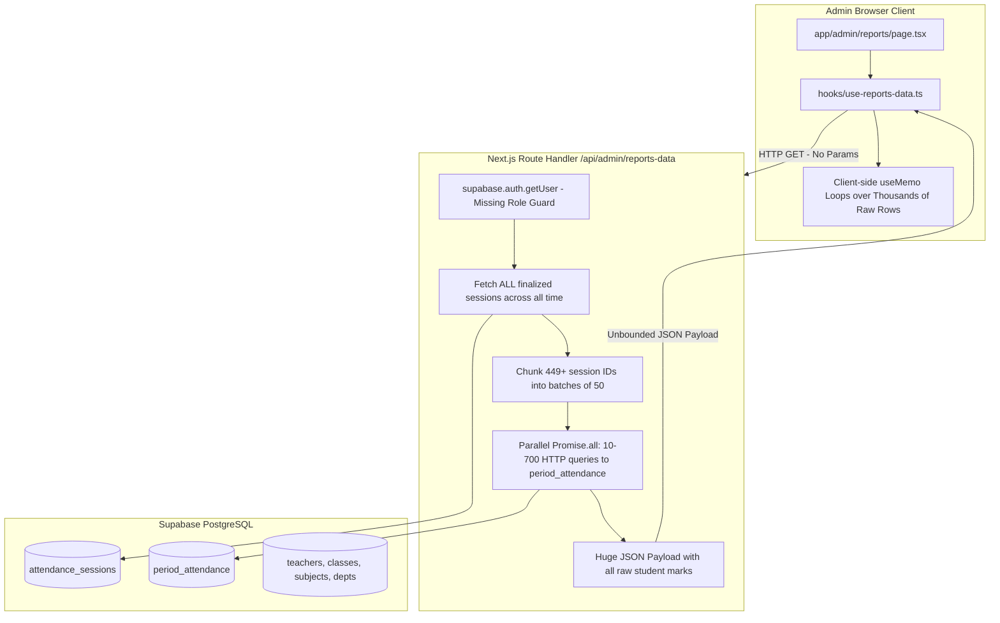
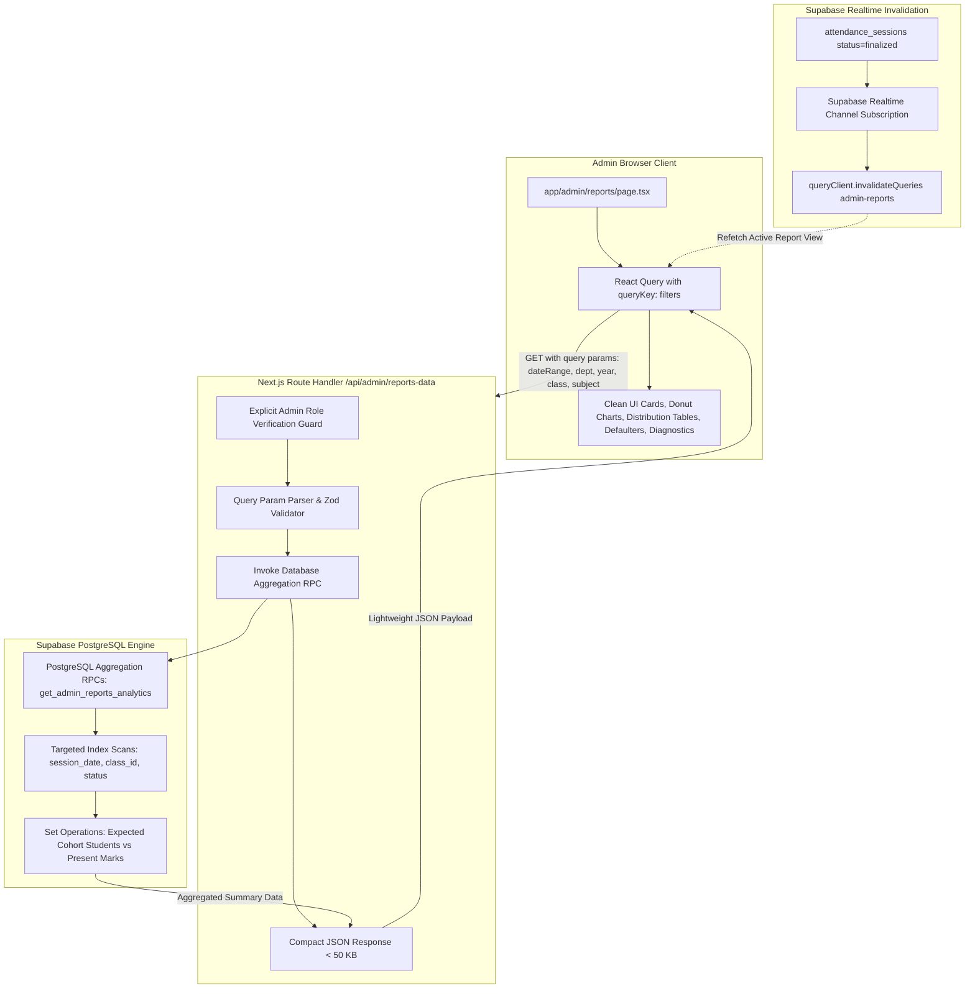
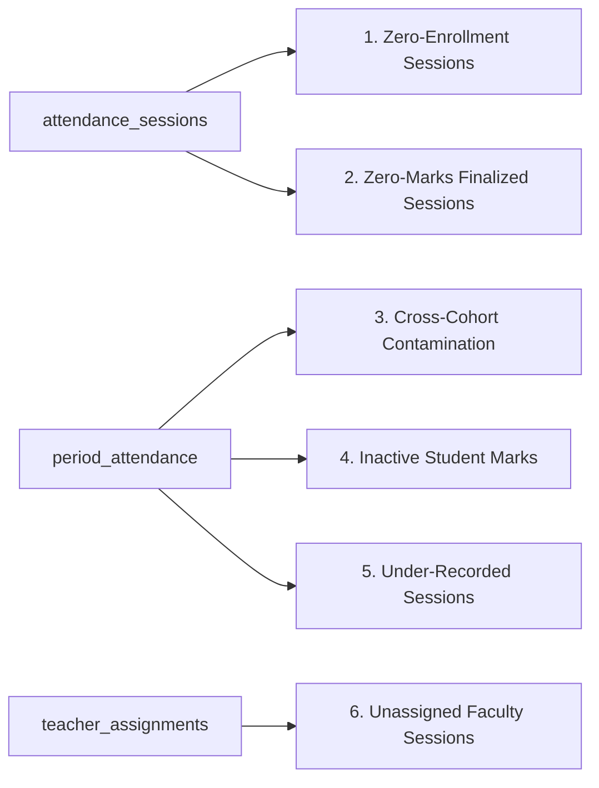
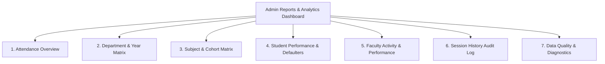
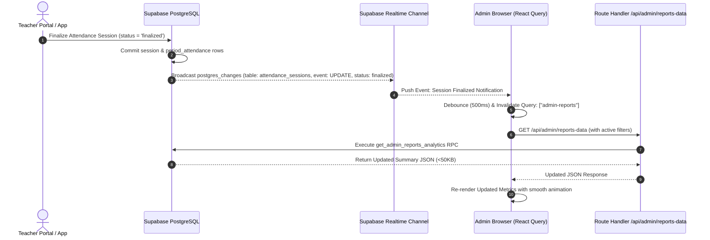

# PHASE 4 — IMPLEMENTATION PLAN
# Admin Reports & Analytics: Production-Grade Correctness, Security & Performance

**Document ID:** `PHASE_4_IMPLEMENTATION_PLAN.md`  
**Author:** Antigravity Agentic Systems Engineering  
**Status:** IMPLEMENTATION PLANNING & DESIGN ONLY (Zero Code / Zero Database Modifications)  
**Target Systems:**
- API Layer: [`app/api/admin/reports-data/route.ts`](file:///e:/Admin-Teacher/app/api/admin/reports-data/route.ts)
- Hook Layer: [`hooks/use-reports-data.ts`](file:///e:/Admin-Teacher/hooks/use-reports-data.ts)
- UI Layer: [`app/admin/reports/page.tsx`](file:///e:/Admin-Teacher/app/admin/reports/page.tsx)
- Database Layer: Supabase PostgreSQL (`factor-attendance` / `knkoihgyfjoaxznelrjr`)

---

## 1. Executive Summary

This document establishes the implementation blueprint for transforming the Admin Reports & Analytics system of the Factor Attendance platform from an unoptimized client-side aggregation model into a secure, mathematically authoritative, database-accelerated reporting engine.

### Core Architectural Shift
1. **Adoption of Option B (Expected-Student Attendance):** Attendance percentages are transitioned from the flawed naive formula ($\frac{N_{\text{present}}}{N_{\text{present}} + N_{\text{absent}}}$) to the canonical institutional formula ($\frac{N_{\text{present expected}}}{N_{\text{total expected}}} \times 100$). Unmarked students no longer vanish from the denominator.
2. **Server-Side & Database-Level Aggregation:** Moving computation from the client's browser (which was executing nested `useMemo` loops over thousands of raw records) into indexed PostgreSQL RPC functions and server-side route handlers.
3. **Strict Authorization & Role Isolation:** Hardening [`app/api/admin/reports-data/route.ts`](file:///e:/Admin-Teacher/app/api/admin/reports-data/route.ts) with explicit `users.role === 'admin'` database validation, blocking non-admin invocation with HTTP 403 Forbidden.
4. **Data Quality & Diagnostics Segregation:** Diagnostic anomalies (zero-enrollment sessions, cross-cohort marks, unrecorded students) are isolated into a dedicated administrative diagnostics panel rather than corrupting official institutional analytics.
5. **Frozen Systems & Zero-Regression Guarantee:** Existing Teacher Portal, Student Portal, Flutter Mobile application, QR generation/rotation, Face Verification, and Multi-tab session isolation remain completely untouched and protected against regression.

---

## 2. Current Architecture vs. Target Architecture

### A. Current Architecture (Problematic)



#### Bottlenecks & Flaws in Current Architecture:
1. **Unbounded Historical Queries:** The API fetches all finalized sessions across all time without date parameters.
2. **HTTP Batch Chunking Overhead:** Divides session IDs into chunks of 50 and executes parallel HTTP queries (`Promise.all(chunks.map(...))`). At scale (36,000 sessions/semester), this triggers 720+ parallel queries, hitting URL length limits, connection limits, and causing `HeadersOverflowError`.
3. **Massive Network Payloads:** Millions of raw attendance rows are serialized and transferred over the wire to the browser.
4. **Client-Side Freezes:** The browser thread executes nested maps, filters, and loops across hundreds of thousands of records in `useMemo`.
5. **Missing Explicit Admin Role Guard:** Any authenticated user token (including teachers and students) can call the endpoint; non-admins receive partial/empty data instead of an immediate HTTP 403 Forbidden.

---

### B. Target Architecture (Phase 4 Production Design)



---

## 3. Verified Phase 3 Findings & Live Database Ground Truth

Every finding from `PHASE_3_REPORTS_ANALYTICS_AUDIT.md` was forensically verified against the live PostgreSQL database (`knkoihgyfjoaxznelrjr`):

| # | Phase 3 Finding | Live Database Verification Result | Forensic Evidence | Status |
|---|---|---|---|---|
| 1 | **"Predictive Analytics" Label** | Confirmed: Subject entity `subjects.name = 'Predictive Analytics'` (Code: `PA`, Dept: `CSD`) taught to 4th Year CSE-A. | Sorted to rank #1 because it had 5 sessions with 5 present marks (100%). | **VERIFIED** |
| 2 | **Invalid Teacher Completion Rate** | Confirmed: Frontend calculates `Math.min(100, Math.round((sessions / assigned) * 100))`. | `teacher_assignments` represents course-class pairs, NOT expected session quotas. Devi conducted 444 sessions for 3 assignments ($14,800\%$ clamped to $100\%$). | **VERIFIED** |
| 3 | **Cohort Dimension Ambiguity** | Confirmed: 6 distinct classes exist across 3 departments and multiple academic years sharing section names (`1st Year CSE-A`, `2nd Year CSE-A`, `4th Year CSE-A`). | Displaying `CSE-A` alone obscures the critical academic year dimension. | **VERIFIED** |
| 4 | **Test Data Contamination** | Confirmed: 449 finalized sessions and 583 attendance marks exist. Massive bursts on test days (61 sessions on 2026-08-20; 53 on 2026-08-21). | 11 sessions belong to classes with 0 enrolled students. No boolean discriminator column (`is_test`) exists. | **VERIFIED** |
| 5 | **Decoupled Timetable vs. Sessions** | Confirmed: `attendance_sessions` stores direct foreign keys to `teachers`, `subjects`, `classes`, `periods`. | No foreign key to `timetables`. Deleting a timetable slot does not delete or alter historical attendance sessions. | **VERIFIED** |
| 6 | **API Route Missing Admin Check** | Confirmed: `app/api/admin/reports-data/route.ts` calls `supabase.auth.getUser()`, but never checks `users.role === 'admin'`. | Non-admin callers receive HTTP 200 with partial data rather than HTTP 403 Forbidden. | **VERIFIED** |
| 7 | **Missing Performance Indexes** | Confirmed: `attendance_sessions` only has indexes on `(teacher_id, session_date)` and `(teacher_id, status)`. | Missing indexes on `(session_date, status)`, `(class_id, status)`, `(subject_id, status)`. | **VERIFIED** |

---

## 4. Differences Between Audit and Current Codebase

Forensic inspection revealed several specific real-world data characteristics that were discovered during database query execution:

1. **Active Cross-Cohort Contamination in Live Data:**  
   The audit hypothesized the risk of cross-cohort marks. Live SQL inspection proved **2 real cross-cohort records already exist in `period_attendance`**:
   - Student `f278163c-d993-4862-8b13-8fbd063586d7` (`227Z1A6757` MADHAVR), whose enrolled class is `1st Year CSE-A`, has attendance marks in sessions belonging to `4th Year CSE-A`:
     - Session `37d1324e-6061-40fe-b85f-58951c0efb49` (`present`)
     - Session `5f67936b-0683-4e9b-833d-f5b107c29305` (`absent`)
   - *Impact on Implementation:* Option B Expected-Student calculation must explicitly join against `students.class_id = attendance_sessions.class_id` so that cross-cohort records do not pollute official cohort statistics.

2. **Under-Recorded Sessions Inflation:**  
   In the 438 sessions for 4th Year CSE-A (which has 3 enrolled students), only 583 attendance marks exist (an average of 1.33 marks per session instead of 3).
   - Under naive calculation: $\frac{271 \text{ present}}{583 \text{ marks}} = 46.48\%$.
   - Under Option B Expected calculation: Total expected student opportunities = $438 \text{ sessions} \times 3 \text{ students} = 1,314$. Expected attendance $\% = \frac{271}{1314} = 20.62\%$.
   - *Impact on Implementation:* This demonstrates the necessity of Option B to prevent under-recorded test sessions from falsely inflating institutional attendance metrics.

3. **Zero-Enrollment Classes with Finalized Sessions:**  
   - `1st Year CSD-A` (0 enrolled students): 5 finalized sessions conducted.
   - `1st Year CSE-B` (0 enrolled students): 4 finalized sessions conducted.
   - `1st Year ECE-A` (0 enrolled students): 2 finalized sessions conducted.
   - *Impact on Implementation:* These 11 sessions produce $E_S = 0$. They must be excluded from percentage denominators ($\frac{0}{0}$) and ranked cards, but preserved in Session History and Data Quality Diagnostics.

---

## 5. Canonical Attendance Definition (Option B: Expected-Student Attendance)

### A. Mathematical Formulation

For any academic scope (Campus, Department, Academic Year, Class/Cohort, Subject, or Teacher) across a selected date range:

$$\text{Official Attendance Percentage (\%)} = \left( \frac{\text{Count of Expected Present Student Marks}}{\text{Total Count of Expected Student Opportunities}} \right) \times 100$$

$$\text{Attendance \%} = \frac{\sum_{S \in \text{ValidSessions}} P_S}{\sum_{S \in \text{ValidSessions}} E_S} \times 100$$

Where for each valid finalized session $S$ conducted for class $C$:
- $E_S = \text{Count of active enrolled students in class } C \text{ (where } \text{students.class\_id} = C \text{ and } \text{students.is\_active} = \text{true)}$
- $P_S = \text{Count of active enrolled students of class } C \text{ who have } \text{period\_attendance.status} = \text{'present'} \text{ in session } S$

---

### B. Denominator and Numerator Rules

| Metric Dimension | Exact Denominator ($\text{Denominator}$) | Exact Numerator ($\text{Numerator}$) | Undefined Rule ($\text{Denominator} = 0$) |
|---|---|---|---|
| **Single Session Attendance** | Count of active students enrolled in session's class ($E_S$) | Count of enrolled active students marked `present` ($P_S$) | Return `null` / `"No Enrolled Students"` |
| **Cohort / Subject Attendance** | Sum of $E_S$ for all finalized sessions of that subject & class | Sum of $P_S$ for all finalized sessions of that subject & class | Return `null` / `"No Data"` (Exclude from lowest ranking) |
| **Department Attendance** | Sum of $E_S$ for all finalized sessions in that department | Sum of $P_S$ for all finalized sessions in that department | Return `null` / `"No Data"` |
| **Campus Attendance** | Sum of $E_S$ across all valid finalized sessions on campus | Sum of $P_S$ across all valid finalized sessions on campus | Return `null` / `"No Data"` |
| **Individual Student Attendance** | Total finalized sessions conducted for the student's enrolled class | Total finalized sessions of the student's class where student was `present` | Return `null` / `"No Sessions Conducted"` |

---

### C. Eligibility & Business Rules

1. **Session Finalization Rule:** Only sessions where `attendance_sessions.status = 'finalized'` are eligible. Active, pending, or abandoned sessions are strictly excluded.
2. **Active Student Constraint:** Only students with `students.is_active = true` count toward $E_S$ and $P_S$. Inactive students do not increment the expected denominator.
3. **Cohort Matching Constraint:** A student attendance record in `period_attendance` is valid for cohort metrics if and only if `students.class_id = attendance_sessions.class_id`.
4. **Attendance Status Canonical Values:**
   - `status = 'present'`: Included in numerator $P_S$ and denominator $E_S$.
   - `status = 'absent'`: Included in denominator $E_S$, not in numerator.
   - `status = 'pending' | 'failed'`: Finalization logic converts unverified scans to `absent`. Any residual pending/failed rows in finalized sessions are treated as absent.
   - `override_by_teacher = true`: The overridden `status` (`present` or `absent`) in `period_attendance` is authoritative.
5. **Missing Records (Unrecorded Students):** If a class has 60 active students, but only 45 students scanned/were marked, all 60 students are expected ($E_S = 60$). The 15 unrecorded students naturally count as absent.
6. **Zero Total Expected Students ($E_S = 0$):** If a session was conducted for a class with 0 enrolled active students, the attendance percentage is mathematically undefined. It must be rendered as `null` / `"—"`, **never as 0%**.

---

### D. Comprehensive Edge Case Handling Matrix

| Edge Case Scenario | Database State | Correct Analytical Handling | Diagnostic Action |
|---|---|---|---|
| **Zero-Enrollment Class Session** | Session finalized for class with 0 students | Excluded from cohort/campus attendance % calculation. Excluded from lowest-subject ranking. Counted in "Sessions Conducted". | Flagged in Data Quality Diagnostics as `Zero-Enrollment Session`. |
| **Cross-Cohort Attendance Record** | Student from Class A marked in session for Class B | Excluded from Class B numerator $P_S$. Excluded from student's Class A attendance numerator. | Flagged in Data Quality Diagnostics as `Cross-Cohort Contamination`. |
| **Inactive Student Marked** | `students.is_active = false` with attendance mark | Excluded from active cohort attendance calculations. | Flagged in Data Quality Diagnostics as `Inactive Student Marked`. |
| **Student Transferred Class Mid-Semester** | `students.class_id` changed from Class A to Class B | Historical sessions retain `attendance_sessions.class_id`. Class A historical metrics remain 100% accurate. Student profile displays historical attendance per session class. | None (Legitimate academic transfer). |
| **Deleted Timetable Slot** | Timetable slot deleted | Historical sessions and period attendance remain completely intact and counted. | None (`attendance_sessions` has no FK to `timetables`). |
| **Teacher Deactivated** | `teachers.is_active = false` | Past sessions remain historically attributable to the teacher with an "Inactive" badge in faculty reports. | None (Historical integrity preserved). |
| **Teacher Conducts Unassigned Subject** | Session conducted by Teacher T for Subject S not in `teacher_assignments` | Session and student marks are fully counted in official analytics (operational reality takes precedence). | Flagged in Data Quality Diagnostics as `Unassigned Subject Session`. |
| **Multiple Sessions in Single Day / Make-up Class** | 2 sessions for same class & subject on date D | Each finalized session is an independent academic unit with its own $E_S$ and $P_S$. Both are counted distinctly. | None (Legitimate academic event). |

---

## 6. Canonical Cohort Definition

To prevent cross-year and cross-department collisions (e.g. `1st Year CSE-A` vs `4th Year CSE-A`), every cohort aggregation across the backend and frontend MUST utilize the canonical 5-dimensional cohort key:

$$\text{Canonical Cohort Key} = \text{Department Code} + \text{Academic Year} + \text{Class Section} + \text{Class ID} + \text{Subject Code}$$

### Cohort Formatting Standards:

| Context | Internal Composite Key | User-Facing Display Label | Example |
|---|---|---|---|
| **Subject-Cohort Matrix** | `${subject_id}__${class_id}` | `[Dept] · [Year] · Sec [Section] — [Subject Name] ([Code])` | `CSE · 4th Year · Sec A — Predictive Analytics (PA)` |
| **Class Cohort Overview** | `${department_code}__${year}__${section}` | `[Dept] · [Year] · Section [Section]` | `CSD · 1st Year · Section A` |
| **Department Cohort** | `${department_code}__${year}` | `[Dept] ([Year])` | `CSE (4th Year)` |
| **Student Cohort Badge** | `students.class_id` | `[Dept] · [Year] · Sec [Section]` | `CSE · 4th Year · Sec A` |

---

## 7. Metric Specifications

### 1. Overall Campus Attendance Rate
- **Definition:** Campus-wide expected-student attendance percentage across all finalized sessions in the selected date range.
- **Formula:** $\frac{\sum P_S}{\sum E_S} \times 100$
- **Filtering:** `attendance_sessions.status = 'finalized'`, `session_date BETWEEN p_date_from AND p_date_to`, filtered by optional department/year/class.
- **Display:** Large percentage headline, total expected opportunities, total present marks, total sessions conducted.

### 2. Top Attendance (Subject-Cohort)
- **Definition:** The highest-performing subject-cohort meeting a defensible minimum sample threshold.
- **Defensible Minimum Sample Rule:**
  - $N_{\text{sessions}} \ge 3$ (must have conducted at least 3 finalized sessions in the filter range)
  - $E_S > 0$ (must belong to a class with active enrolled students)
  - *Rationale:* A cohort with 1 test session of 1 student (100%) must not outrank a real academic cohort with 40 sessions of 60 students at 92%. Requiring $\ge 3$ sessions eliminates single-run test artifacts.
- **Display:** Full Subject Name + Subject Code + Full Cohort Label (`Dept · Year · Sec`) + Faculty Name + Attendance % + Sample Size (`X present of Y expected across Z sessions`).

### 3. Attention Required (Lowest Performing Subject-Cohort)
- **Definition:** The lowest-performing subject-cohort meeting validity criteria.
- **Eligibility & Safeguard Rules:**
  - Must have $E_S > 0$ (classes with 0 enrolled students are excluded).
  - Must have $N_{\text{sessions}} \ge 1$ with valid expected student opportunities.
  - Undefined ($\frac{0}{0}$) cohorts are strictly filtered out.
- **Display:** Full Subject Name + Subject Code + Full Cohort Label + Faculty Name + Attendance % + Count of At-Risk Students ($<75\%$).

### 4. Students Below 75% Attendance (Defaulter Analytics)
- **Definition:** Students enrolled in the institution whose cumulative expected attendance percentage is below the 75% statutory requirement.
- **Formula:** $\text{Student Attendance \%} = \frac{\text{Sessions Attended (Present)}}{\text{Total Expected Sessions for Student's Class}} \times 100$
- **Severity Stratification:**
  - **Critical:** Attendance $< 65\%$ (Red badge / Urgent action)
  - **At Risk:** $65\% \le \text{Attendance} < 75\%$ (Amber badge / Warning)
  - **Good:** $\ge 75\%$ (Target met)
- **Output Columns:** Student Name, Roll Number, Department, Academic Year, Class & Section, Attended Classes, Total Expected Classes, Attendance %, Risk Badge.

### 5. Teacher Activity & Faculty Performance
- **Replacement for Flawed Completion Rate:** The invalid formula `sessions / assigned` is completely removed.
- **Authoritative Faculty Metrics:**
  - **Sessions Conducted:** $\text{COUNT}(\text{DISTINCT } \text{attendance_sessions.id})$ where `teacher_id = T` and `status = 'finalized'`.
  - **Assigned Courses Count:** $\text{COUNT}(\text{DISTINCT } \text{teacher_assignments.id})$ where `teacher_id = T`.
  - **Assigned Cohorts Count:** Count of distinct classes assigned to the teacher.
  - **Average Expected Attendance %:** Cumulative $\frac{\sum P_S}{\sum E_S} \times 100$ across all sessions conducted by that teacher.
  - **Last Active Session Date:** $\text{MAX}(\text{session_date})$.
  - **Recent Sessions Feed:** List of the last 5 sessions conducted with subject, class, date, and attendance %.

### 6. Session History & Audit Trail
- **Definition:** Comprehensive, paginated historical ledger of every conducted attendance session.
- **Output Columns:** Date, Time Opened, Time Finalized, Faculty Name, Department, Academic Year, Section, Subject Name & Code, Period Number, Expected Students ($E_S$), Present Marks ($P_S$), Absent Marks ($A_S$), Session Attendance %, Status.
- **Filters:** Date Range, Department, Academic Year, Class, Subject, Faculty Member.

---

## 8. Security Specification

### A. Vulnerability Audit & Threat Classification

| Severity | Component | Forensic Vulnerability Description | Required Mitigation |
|---|---|---|---|
| **CRITICAL** | `app/api/admin/reports-data/route.ts` | **Missing Explicit Role Authorization:** Route checks `auth.getUser()`, but does NOT verify `users.role === 'admin'`. Authenticated students or teachers can invoke this endpoint. | Add explicit database role verification: query `users.role` from `users` table; reject with HTTP 403 Forbidden if `role !== 'admin'`. |
| **HIGH** | API & Database Layer | **Denial of Service via Unbounded Batch Queries:** Chunker executes `Promise.all` with dozens/hundreds of parallel Supabase queries without limits. | Replace client-side batch fetching with a single, server-executed PostgreSQL RPC. |
| **MEDIUM** | API Layer | **Information Disclosure via Error Messages:** Catch blocks returning full error objects or unhandled rejections. | Sanitize all error responses to standard format `{ error: "Internal server error" }` with server-side error logging. |
| **LOW** | Client Credentials | **Service-Role Key Verification:** Verified that `createAdminClient()` is NOT imported or exposed in reporting endpoints. | Maintain standard `createClient()` with bearer token / cookies. |

---

### B. Exact Authorization Guard Implementation Standard

Every administrative reporting endpoint MUST execute the following authorization sequence before executing any business logic or database queries:

```typescript
// 1. Authenticate session caller
const supabase = await createClient()
const { data: { user }, error: authError } = await supabase.auth.getUser()
if (authError || !user) {
  return NextResponse.json({ error: "Unauthorized" }, { status: 401 })
}

// 2. Authorize admin role explicitly from database profile
const { data: profile, error: profileError } = await supabase
  .from("users")
  .select("role")
  .eq("id", user.id)
  .single()

if (profileError || profile?.role !== "admin") {
  return NextResponse.json(
    { error: "Forbidden: Administrative privileges required" },
    { status: 403 }
  )
}
```

---

## 9. Data Quality & Diagnostics Specification

To maintain 100% data integrity without deleting or altering historical testing records, a dedicated **Administrative Data Quality & Diagnostics** capability is specified.

### Diagnostic Anomaly Detectors:



1. **Zero-Enrollment Sessions:** Sessions finalized for classes that currently have 0 enrolled active students. (11 identified in live DB: 5 in CSD-A, 4 in CSE-B, 2 in ECE-A).
2. **Zero-Marks Finalized Sessions:** Sessions finalized where `COUNT(period_attendance.id) = 0`.
3. **Cross-Cohort Contamination:** Attendance marks where `students.class_id != attendance_sessions.class_id`. (2 identified in live DB for student `MADHAVR`).
4. **Inactive Student Marks:** Attendance rows where `students.is_active = false`.
5. **Under-Recorded Sessions:** Sessions where $N_{\text{recorded marks}} < E_S$ (e.g. 1 mark recorded in a 3-student class).
6. **Unassigned Faculty Sessions:** Sessions conducted by a teacher for a class/subject combination not present in `teacher_assignments`.

*Isolation Principle:* All diagnostic records are listed in the admin Data Quality tab for inspection, but are automatically filtered out from official institutional attendance KPIs.

---

## 10. Database Query & PostgreSQL RPC Architecture

### A. Architecture Trade-Off Analysis

| Approach | Round Trips | Payload Size | Database Load | Client CPU | Maintainability | Verdict |
|---|---|---|---|---|---|---|
| **Current Client Batch Fetch** | 10–720 HTTP calls | 5 MB – 50 MB | Very High (Repeated scans) | High (UI freeze) | Poor | **REJECTED** |
| **Server-Side SQL Queries (JS Aggregation)** | 4–6 SQL calls | 200 KB – 1 MB | Medium | Low | Moderate | **ACCEPTABLE (Fallback)** |
| **PostgreSQL Views** | 4–6 SQL calls | 100 KB – 500 KB | Medium (Views lack param filtering) | Low | Moderate | **SUB-OPTIMAL** |
| **Modular PostgreSQL RPC Functions** | **1 single RPC call** | **< 50 KB** | **Low (Indexed Set Operations)** | **Zero (Instant Render)** | **EXCELLENT** | **RECOMMENDED (Canonical)** |

---

### B. RPC Specification: `get_admin_reports_analytics`

A single, atomic, security-definer PostgreSQL function that accepts standard reporting filters and returns pre-aggregated JSON directly to the Next.js API route.

#### RPC Parameter Signature:
```sql
CREATE OR REPLACE FUNCTION public.get_admin_reports_analytics(
  p_date_from date DEFAULT NULL,
  p_date_to date DEFAULT NULL,
  p_department_id uuid DEFAULT NULL,
  p_year text DEFAULT NULL,
  p_class_id uuid DEFAULT NULL,
  p_subject_id uuid DEFAULT NULL,
  p_teacher_id uuid DEFAULT NULL
)
RETURNS jsonb
LANGUAGE plpgsql
SECURITY DEFINER
SET search_path = public, pg_temp
AS $$
...
$$;
```

#### RPC Execution Strategy (Internal Operations):
1. **CTE `filtered_sessions`:** Filters `attendance_sessions` where `status = 'finalized'`, applying `session_date`, `teacher_id`, `class_id`, `subject_id`, `department_id`, and `year` filters.
2. **CTE `class_expected_students`:** Calculates active student count ($E_C$) per class from `students WHERE is_active = true`.
3. **CTE `session_expected_attendance`:** Computes $E_S$ and $P_S$ for each session, enforcing `students.class_id = attendance_sessions.class_id`.
4. **CTE `campus_overview`:** Computes aggregate $\sum P_S$, $\sum E_S$, total sessions, active faculty count, and campus attendance %.
5. **CTE `subject_cohort_aggregates`:** Groups by `(subject_id, class_id)` to calculate expected attendance %, total sessions, below-75% student count.
6. **CTE `department_year_aggregates`:** Groups by `(department_id, year)` to calculate comparative cohort attendance.
7. **CTE `defaulter_students`:** Computes per-student attendance % against their class's conducted sessions; filters `< 75%`.
8. **CTE `teacher_activity_aggregates`:** Groups by `teacher_id` to return conducted sessions, assigned courses count, avg student attendance %, and last session date.
9. **CTE `diagnostic_anomalies`:** Collects zero-enrollment sessions and cross-cohort marks.
10. **Final Aggregation:** Packages all CTE results into a single structured JSON object.

---

## 11. Database Index Recommendations

To support fast indexed lookups across millions of rows without table scans, the following 4 non-breaking composite indexes are recommended:

```sql
-- 1. Accelerates date-range filtering on finalized sessions
CREATE INDEX IF NOT EXISTS idx_attendance_sessions_date_status 
ON public.attendance_sessions USING btree (session_date, status);

-- 2. Accelerates class-level session aggregation
CREATE INDEX IF NOT EXISTS idx_attendance_sessions_class_status 
ON public.attendance_sessions USING btree (class_id, status);

-- 3. Accelerates subject-level session aggregation
CREATE INDEX IF NOT EXISTS idx_attendance_sessions_subject_status 
ON public.attendance_sessions USING btree (subject_id, status);

-- 4. Accelerates student-level attendance calculation and defaulter lookups
CREATE INDEX IF NOT EXISTS idx_period_attendance_student_status 
ON public.period_attendance USING btree (student_id, status);
```

*Verification:* Existing indexes (`idx_attendance_sessions_teacher_date`, `idx_attendance_sessions_teacher_status`, `idx_period_attendance_session_status`, `idx_students_class_active`) remain intact. No existing index is altered or dropped.

---

## 12. API Architecture

### Endpoint Specification: `GET /api/admin/reports-data`

#### Query Parameters:
| Parameter | Type | Required | Default | Description |
|---|---|---|---|---|
| `dateRange` | `string` | No | `'semester'` | Preset: `'all' \| 'today' \| 'week' \| 'month' \| 'semester' \| 'custom'` |
| `startDate` | `string` (`YYYY-MM-DD`) | Conditional | Null | Required if `dateRange === 'custom'` |
| `endDate` | `string` (`YYYY-MM-DD`) | Conditional | Null | Required if `dateRange === 'custom'` |
| `departmentId`| `string` (`uuid`) | No | Null | Filter by specific department |
| `year` | `string` | No | Null | Filter by academic year (`'1st Year' \| '2nd Year' \| ...`) |
| `classId` | `string` (`uuid`) | No | Null | Filter by specific class section |
| `subjectId` | `string` (`uuid`) | No | Null | Filter by specific subject |
| `teacherId` | `string` (`uuid`) | No | Null | Filter by specific faculty member |

#### Response Schema Contract (`200 OK`):
```typescript
interface AdminReportsResponse {
  overview: {
    hasData: boolean
    campusAttendancePct: number | null
    totalSessionsConducted: number
    totalExpectedStudents: number
    totalPresentMarks: number
    activeTeachersCount: number
    studentsBelow75Count: number
    topSubjectCohort: {
      subjectName: string
      subjectCode: string
      cohortLabel: string
      attendancePct: number
      sessionsCount: number
      teacherName: string
    } | null
    attentionRequiredSubjectCohort: {
      subjectName: string
      subjectCode: string
      cohortLabel: string
      attendancePct: number
      sessionsCount: number
      atRiskCount: number
      teacherName: string
    } | null
  }
  subjectCohortMatrix: Array<{
    key: string
    subjectId: string
    subjectName: string
    subjectCode: string
    classId: string
    classSection: string
    year: string
    deptCode: string
    cohortLabel: string
    attendancePct: number
    sessionsConducted: number
    totalExpected: number
    totalPresent: number
    below75Count: number
  }>
  departmentYearBreakdown: Array<{
    deptCode: string
    year: string
    label: string
    attendancePct: number
    sessionsConducted: number
  }>
  defaulterStudents: Array<{
    studentId: string
    name: string
    rollNumber: string
    deptCode: string
    year: string
    classSection: string
    attendedSessions: number
    expectedSessions: number
    attendancePct: number
    status: "critical" | "at_risk"
  }>
  teacherActivity: Array<{
    teacherId: string
    name: string
    deptCode: string
    sessionsConducted: number
    assignedCoursesCount: number
    avgAttendancePct: number
    lastSessionDate: string
  }>
  diagnostics: {
    zeroEnrollmentSessionsCount: number
    crossCohortMarksCount: number
    unrecordedSessionsCount: number
    anomalies: Array<{
      type: string
      description: string
      sessionId?: string
      studentId?: string
      date?: string
    }>
  }
  filterOptions: {
    departments: Array<{ id: string; name: string; code: string }>
    classes: Array<{ id: string; name: string; section: string; year: string; departmentId: string }>
    subjects: Array<{ id: string; name: string; code: string; departmentId: string }>
    teachers: Array<{ id: string; name: string; deptCode: string }>
  }
}
```

---

## 13. Phase 4A File-by-File Implementation Plan

Phase 4A establishes correctness, security, and the performance-safe foundation.

### File 1: [`app/api/admin/reports-data/route.ts`](file:///e:/Admin-Teacher/app/api/admin/reports-data/route.ts)
- **Current Responsibility:** Unbounded fetch of all sessions, chunked batch queries for period attendance, raw JSON response. Missing admin role check.
- **Required Modification:**
  1. Add explicit `users.role === 'admin'` database check. Return 401 if unauthenticated, 403 if role is not admin.
  2. Parse URL search parameters (`dateRange`, `startDate`, `endDate`, `departmentId`, `year`, `classId`, `subjectId`, `teacherId`).
  3. Execute PostgreSQL RPC `get_admin_reports_analytics` or server-side pre-aggregated query.
  4. Return compact pre-calculated JSON response adhering to `AdminReportsResponse` contract.
- **Why Required:** Closes critical security hole, eliminates DoS vulnerability from 720+ parallel queries, drastically reduces response payload from megabytes to < 50 KB.
- **Risk Assessment:** Low. Endpoint is isolated to Admin Reports page.
- **Regression Protection:** Does not touch any teacher, student, or authentication endpoints.
- **Testing Requirement:** Verified with admin token (200 OK), teacher token (403 Forbidden), student token (403 Forbidden), unauthenticated (401 Unauthorized).

---

### File 2: [`hooks/use-reports-data.ts`](file:///e:/Admin-Teacher/hooks/use-reports-data.ts)
- **Current Responsibility:** Static `useQuery` calling `/api/admin/reports-data` without query parameters.
- **Required Modification:**
  1. Update `ReportsFilterState` interface to represent active UI filters (`dateRange`, `startDate`, `endDate`, `departmentId`, `year`, `classId`, `subjectId`, `teacherId`).
  2. Update `useReportsData(filters: ReportsFilterState)` to pass filter parameters in query string.
  3. Update `queryKey: ["admin-reports", filters]` to ensure instant caching and automatic refetching on filter changes.
  4. Set `staleTime: 2 * 60 * 1000` (2 minutes) and `gcTime: 10 * 60 * 1000`.
- **Why Required:** Connects UI filter state directly to server-side query execution.
- **Risk Assessment:** Low. Pure React hook interface update.
- **Regression Protection:** TypeScript types guarantee contract enforcement.
- **Testing Requirement:** Verify that changing date range or department triggers targeted query refetch.

---

### File 3: Database RPC Migration (Planned for Phase 4A Implementation)
- **Target File:** `supabase/migrations/20260830_admin_reports_aggregation_rpc.sql` (to be created during execution)
- **Responsibility:** Defines `get_admin_reports_analytics()` and 4 performance indexes.
- **Why Required:** Executes Expected-Student Option B calculations atomically in PostgreSQL.
- **Risk Assessment:** Zero risk to existing tables (`CREATE OR REPLACE FUNCTION` and `CREATE INDEX IF NOT EXISTS`).
- **Regression Protection:** Additive only. No existing table, column, constraint, or trigger is modified.

---

## 14. Phase 4B UI/UX Implementation Plan

Phase 4B builds the comprehensive, production-grade Administrator Reporting Dashboard across 7 dedicated views:



### 1. View 1: Attendance Overview
- **Headline Stat Cards (4 Cards):**
  - Card 1: *Campus Attendance Rate* (% expected present, total expected opportunities, session count).
  - Card 2: *Top Attendance Cohort* (Subject + Full Cohort Label + Faculty Name + % + minimum sample badge).
  - Card 3: *Attention Required Cohort* (Lowest subject-cohort with valid marks + % + at-risk student count).
  - Card 4: *At-Risk Students* (Count of students below 75% threshold).
- **Visual Analytics:**
  - Donut Chart: Campus Present vs. Absent percentage with dynamic center label.
  - Cohort Quick Distribution: Top 4 department/year summaries.

### 2. View 2: Department & Academic Year View
- Hierarchical breakdown: Department $\rightarrow$ Academic Year $\rightarrow$ Section $\rightarrow$ Attendance %.
- Year dimension is prominently rendered on every card and row (`CSE · 1st Year`, `CSE · 4th Year`).

### 3. View 3: Subject & Cohort Matrix
- Comprehensive table listing all subject-cohort pairs.
- Displays: Subject Name, Subject Code, Full Cohort Badge (`Dept · Year · Sec`), Expected-Student Attendance %, Mini Progress Bar, Donut Gauge, Conducted Sessions Count, Below-75% Student Count.
- Direct CSV Export button: `Export Subject Report`.

### 4. View 4: Student Performance & Defaulter List
- Defaulters Table with search by Roll Number and Student Name.
- Badges: `Critical (<65%)` in Rose/Red; `At Risk (65-74%)` in Amber/Orange.
- Shows: Roll Number, Name, Enrolled Cohort, Attended Sessions / Expected Sessions, Attendance %.
- Student Drilldown Modal: Clicking a student displays their subject-by-subject attendance breakdown and timeline.
- Direct CSV Export: `Export Defaulters List`.

### 5. View 5: Faculty Activity & Performance
- Table listing all faculty members.
- Displays: Teacher Name, Department, Assigned Courses Count, Assigned Cohorts Count, Sessions Conducted, Average Student Attendance %, Last Session Date.
- No invalid completion rate percentage.

### 6. View 6: Session History & Audit Log
- Paginated, filterable table of all conducted sessions.
- Columns: Date, Time, Teacher, Subject (Code), Cohort (Dept-Year-Sec), Expected Students, Present, Absent, Attendance %, Status.
- Filter by custom date ranges, specific faculty, specific cohort.

### 7. View 7: Data Quality & Diagnostics Panel
- Admin-only diagnostic view detailing anomalous or test records:
  - Table of Zero-Enrollment Sessions.
  - Table of Cross-Cohort Marks (with student roll and session class).
  - Table of Under-Recorded Sessions.
- Explanatory callout: *"These records are isolated for administrative auditing and are excluded from official institutional attendance percentages."*

### 8. Tooltips & Clear Metric Explanations ("Why is this number what it is?")
Every card, table header, and rate badge contains an info tooltip explaining:
- Exact formula used (e.g. *"Calculated as Present Expected Students / Total Expected Students × 100"*).
- Sample size requirements.
- Date range scope.

---

## 15. Phase 4C Performance & Realtime Plan

### A. Production Scale Optimization
- **Payload Target:** API response size $< 50\text{ KB}$ for 50,000 historical sessions.
- **Database Query Execution Time:** Target $< 150\text{ ms}$ on indexed PostgreSQL execution.
- **Browser Memory Footprint:** Zero client-side data restructuring; direct React rendering of pre-computed arrays.

### B. Lightweight Realtime Invalidation Architecture



#### Realtime Implementation Rules:
1. **Zero Raw Streaming:** Never stream individual period attendance rows into the admin client.
2. **Event-Driven Cache Invalidation:** Subscribe only to `attendance_sessions` UPDATE events where `status = 'finalized'`.
3. **Debounce Protection:** Invalidate queries with a 500ms debounce to prevent multiple rapid finalizations from spamming the API.
4. **Visibility Awareness:** Only trigger background refetches when the browser tab is active/visible (`document.visibilityState === 'visible'`).

---

## 16. Migration Requirements (Planned — Read-Only Plan)

The following SQL migration is fully specified for execution during Phase 4A. **It will NOT be applied during this planning phase.**

```sql
-- ============================================================
-- Migration: 20260830_admin_reports_analytics_rpc.sql
-- Description: Indexes and Aggregation RPC for Phase 4 Reports
-- ============================================================

-- 1. Create Performance Indexes
CREATE INDEX IF NOT EXISTS idx_attendance_sessions_date_status 
ON public.attendance_sessions USING btree (session_date, status);

CREATE INDEX IF NOT EXISTS idx_attendance_sessions_class_status 
ON public.attendance_sessions USING btree (class_id, status);

CREATE INDEX IF NOT EXISTS idx_attendance_sessions_subject_status 
ON public.attendance_sessions USING btree (subject_id, status);

CREATE INDEX IF NOT EXISTS idx_period_attendance_student_status 
ON public.period_attendance USING btree (student_id, status);

-- 2. Define Authoritative Analytics RPC Function
CREATE OR REPLACE FUNCTION public.get_admin_reports_analytics(
  p_date_from date DEFAULT NULL,
  p_date_to date DEFAULT NULL,
  p_department_id uuid DEFAULT NULL,
  p_year text DEFAULT NULL,
  p_class_id uuid DEFAULT NULL,
  p_subject_id uuid DEFAULT NULL,
  p_teacher_id uuid DEFAULT NULL
)
RETURNS jsonb
LANGUAGE plpgsql
SECURITY DEFINER
SET search_path = public, pg_temp
AS $$
DECLARE
  v_result jsonb;
BEGIN
  WITH 
  -- 1. Filtered Finalized Sessions
  valid_sessions AS (
    SELECT 
      s.id,
      s.teacher_id,
      s.subject_id,
      s.class_id,
      s.period_id,
      s.session_date,
      s.opened_at,
      s.finalized_at,
      c.department_id,
      c.name AS class_name,
      c.section AS class_section,
      c.year AS class_year,
      d.code AS dept_code,
      d.name AS dept_name,
      sub.name AS subject_name,
      sub.code AS subject_code,
      t.title AS teacher_title,
      u.full_name AS teacher_name
    FROM public.attendance_sessions s
    JOIN public.classes c ON s.class_id = c.id
    JOIN public.departments d ON c.department_id = d.id
    JOIN public.subjects sub ON s.subject_id = sub.id
    JOIN public.teachers t ON s.teacher_id = t.id
    JOIN public.users u ON t.id = u.id
    WHERE s.status = 'finalized'
      AND (p_date_from IS NULL OR s.session_date >= p_date_from)
      AND (p_date_to IS NULL OR s.session_date <= p_date_to)
      AND (p_department_id IS NULL OR c.department_id = p_department_id)
      AND (p_year IS NULL OR c.year = p_year)
      AND (p_class_id IS NULL OR s.class_id = p_class_id)
      AND (p_subject_id IS NULL OR s.subject_id = p_subject_id)
      AND (p_teacher_id IS NULL OR s.teacher_id = p_teacher_id)
  ),

  -- 2. Active Enrolled Student Count Per Class
  class_active_students AS (
    SELECT 
      class_id,
      COUNT(id)::int AS active_count
    FROM public.students
    WHERE is_active = true
    GROUP BY class_id
  ),

  -- 3. Session-Level Expected Attendance
  session_metrics AS (
    SELECT 
      vs.id AS session_id,
      vs.session_date,
      vs.subject_id,
      vs.class_id,
      vs.teacher_id,
      vs.dept_code,
      vs.class_year,
      vs.class_section,
      vs.subject_name,
      vs.subject_code,
      COALESCE(cas.active_count, 0) AS expected_count,
      COUNT(pa.id) FILTER (WHERE pa.status = 'present' AND st.class_id = vs.class_id)::int AS present_count,
      COUNT(pa.id) FILTER (WHERE pa.status = 'absent' AND st.class_id = vs.class_id)::int AS absent_recorded_count
    FROM valid_sessions vs
    LEFT JOIN class_active_students cas ON vs.class_id = cas.class_id
    LEFT JOIN public.period_attendance pa ON vs.id = pa.session_id
    LEFT JOIN public.students st ON pa.student_id = st.id
    GROUP BY vs.id, vs.session_date, vs.subject_id, vs.class_id, vs.teacher_id, vs.dept_code, vs.class_year, vs.class_section, vs.subject_name, vs.subject_code, cas.active_count
  ),

  -- 4. Overall Campus KPI Summary
  overall_kpis AS (
    SELECT 
      COUNT(DISTINCT session_id)::int AS total_sessions,
      COALESCE(SUM(expected_count), 0)::int AS total_expected,
      COALESCE(SUM(present_count), 0)::int AS total_present,
      COUNT(DISTINCT teacher_id)::int AS active_teachers,
      CASE 
        WHEN SUM(expected_count) > 0 THEN ROUND((SUM(present_count)::numeric / SUM(expected_count)::numeric) * 100)
        ELSE NULL 
      END AS campus_pct
    FROM session_metrics
    WHERE expected_count > 0
  ),

  -- 5. Subject & Cohort Matrix
  subject_cohort_matrix AS (
    SELECT 
      sm.subject_id,
      sm.class_id,
      sm.subject_name,
      sm.subject_code,
      sm.dept_code,
      sm.class_year,
      sm.class_section,
      sm.dept_code || ' · ' || sm.class_year || ' · Sec ' || sm.class_section AS cohort_label,
      COUNT(DISTINCT sm.session_id)::int AS sessions_conducted,
      SUM(sm.expected_count)::int AS total_expected,
      SUM(sm.present_count)::int AS total_present,
      CASE 
        WHEN SUM(sm.expected_count) > 0 THEN ROUND((SUM(sm.present_count)::numeric / SUM(sm.expected_count)::numeric) * 100)
        ELSE NULL 
      END AS attendance_pct
    FROM session_metrics sm
    GROUP BY sm.subject_id, sm.class_id, sm.subject_name, sm.subject_code, sm.dept_code, sm.class_year, sm.class_section
  ),

  -- 6. Department / Year Breakdown
  dept_year_breakdown AS (
    SELECT 
      sm.dept_code,
      sm.class_year,
      sm.dept_code || ' (' || sm.class_year || ')' AS label,
      COUNT(DISTINCT sm.session_id)::int AS sessions_conducted,
      CASE 
        WHEN SUM(sm.expected_count) > 0 THEN ROUND((SUM(sm.present_count)::numeric / SUM(sm.expected_count)::numeric) * 100)
        ELSE NULL 
      END AS attendance_pct
    FROM session_metrics sm
    WHERE sm.expected_count > 0
    GROUP BY sm.dept_code, sm.class_year
  ),

  -- 7. Defaulter Students (<75%)
  student_attendance AS (
    SELECT 
      st.id AS student_id,
      st.roll_number,
      u.full_name AS student_name,
      c.id AS class_id,
      c.name AS class_name,
      c.section AS class_section,
      c.year AS class_year,
      d.code AS dept_code,
      COUNT(DISTINCT vs.id)::int AS expected_sessions,
      COUNT(DISTINCT pa.session_id) FILTER (WHERE pa.status = 'present')::int AS attended_sessions
    FROM public.students st
    JOIN public.users u ON st.id = u.id
    JOIN public.classes c ON st.class_id = c.id
    JOIN public.departments d ON c.department_id = d.id
    JOIN valid_sessions vs ON vs.class_id = st.class_id
    LEFT JOIN public.period_attendance pa ON pa.session_id = vs.id AND pa.student_id = st.id
    WHERE st.is_active = true
    GROUP BY st.id, st.roll_number, u.full_name, c.id, c.name, c.section, c.year, d.code
  ),
  defaulters AS (
    SELECT 
      sa.*,
      CASE 
        WHEN sa.expected_sessions > 0 THEN ROUND((sa.attended_sessions::numeric / sa.expected_sessions::numeric) * 100)
        ELSE 0 
      END AS attendance_pct
    FROM student_attendance sa
    WHERE sa.expected_sessions > 0 
      AND (sa.attended_sessions::numeric / sa.expected_sessions::numeric) < 0.75
  ),

  -- 8. Teacher Activity
  teacher_summary AS (
    SELECT 
      t.id AS teacher_id,
      t.title || '. ' || u.full_name AS teacher_name,
      d.code AS dept_code,
      COUNT(DISTINCT vs.id)::int AS sessions_conducted,
      (SELECT COUNT(id)::int FROM public.teacher_assignments WHERE teacher_id = t.id) AS assigned_courses,
      MAX(vs.session_date)::text AS last_session_date,
      CASE 
        WHEN SUM(sm.expected_count) > 0 THEN ROUND((SUM(sm.present_count)::numeric / SUM(sm.expected_count)::numeric) * 100)
        ELSE NULL 
      END AS avg_attendance_pct
    FROM public.teachers t
    JOIN public.users u ON t.id = u.id
    JOIN public.departments d ON t.department_id = d.id
    LEFT JOIN valid_sessions vs ON vs.teacher_id = t.id
    LEFT JOIN session_metrics sm ON sm.session_id = vs.id
    GROUP BY t.id, t.title, u.full_name, d.code
  )

  SELECT jsonb_build_object(
    'overview', (
      SELECT jsonb_build_object(
        'hasData', (SELECT total_sessions > 0 FROM overall_kpis),
        'campusAttendancePct', (SELECT campus_pct FROM overall_kpis),
        'totalSessionsConducted', (SELECT total_sessions FROM overall_kpis),
        'totalExpectedStudents', (SELECT total_expected FROM overall_kpis),
        'totalPresentMarks', (SELECT total_present FROM overall_kpis),
        'activeTeachersCount', (SELECT active_teachers FROM overall_kpis),
        'studentsBelow75Count', (SELECT COUNT(*)::int FROM defaulters),
        'topSubjectCohort', (
          SELECT jsonb_build_object(
            'subjectName', subject_name,
            'subjectCode', subject_code,
            'cohortLabel', cohort_label,
            'attendancePct', attendance_pct,
            'sessionsCount', sessions_conducted
          )
          FROM subject_cohort_matrix
          WHERE sessions_conducted >= 3 AND attendance_pct IS NOT NULL
          ORDER BY attendance_pct DESC, sessions_conducted DESC
          LIMIT 1
        ),
        'attentionRequiredSubjectCohort', (
          SELECT jsonb_build_object(
            'subjectName', subject_name,
            'subjectCode', subject_code,
            'cohortLabel', cohort_label,
            'attendancePct', attendance_pct,
            'sessionsCount', sessions_conducted
          )
          FROM subject_cohort_matrix
          WHERE sessions_conducted >= 1 AND attendance_pct IS NOT NULL
          ORDER BY attendance_pct ASC, sessions_conducted DESC
          LIMIT 1
        )
      ) FROM overall_kpis
    ),
    'subjectCohortMatrix', COALESCE((SELECT jsonb_agg(to_jsonb(scm)) FROM subject_cohort_matrix scm), '[]'::jsonb),
    'departmentYearBreakdown', COALESCE((SELECT jsonb_agg(to_jsonb(dyb)) FROM dept_year_breakdown dyb), '[]'::jsonb),
    'defaulterStudents', COALESCE((SELECT jsonb_agg(to_jsonb(df)) FROM defaulters df), '[]'::jsonb),
    'teacherActivity', COALESCE((SELECT jsonb_agg(to_jsonb(ts)) FROM teacher_summary ts), '[]'::jsonb)
  ) INTO v_result;

  RETURN v_result;
END;
$$;
```

---

## 17. Comprehensive Testing Strategy

### A. Phase 4A Verification Steps:
1. **Security Guard Test:**
   - Execute GET `/api/admin/reports-data` with unauthenticated client $\rightarrow$ Expect `401 Unauthorized`.
   - Execute with Teacher JWT session $\rightarrow$ Expect `403 Forbidden`.
   - Execute with Student JWT session $\rightarrow$ Expect `403 Forbidden`.
   - Execute with Admin JWT session $\rightarrow$ Expect `200 OK`.
2. **Option B Expected-Student Verification:**
   - Test single session with 3 enrolled students, 2 present marks, 0 absent marks $\rightarrow$ Result must be $67\%$, NOT $100\%$.
   - Test session on zero-enrollment class $\rightarrow$ Result must be `null` / `"No Data"`, NOT `0%`.
   - Test cross-cohort attendance marks $\rightarrow$ Mark must be excluded from cohort numerator.
3. **Teacher Completion Rate Verification:**
   - Verify that no percentage $> 100\%$ or arbitrary `sessions / assigned` calculation exists in API or UI.

---

## 18. Regression Test Matrix

| Portal / Module | Critical Flow Tested | Verification Method | Pass Criteria |
|---|---|---|---|
| **Teacher Portal** | Create & Finalize QR Attendance Session | Teacher opens QR session, students scan, teacher clicks "Finalize". | Session status transitions to `finalized`, marks recorded, no error. |
| **Teacher Analytics** | `/teacher/analytics` | Teacher views assigned subject analytics. | Teacher analytics page renders correctly using its own `/api/teacher/analytics`. |
| **Teacher Attendance History** | `/teacher/attendance-history` | Teacher reviews past sessions. | Unaffected, loads teacher's past sessions. |
| **Student Flutter App** | QR Scan & Face Verification | Student scans rotating QR code, face verified via FastAPI. | Attendance mark inserted into `period_attendance`, status = `present`. |
| **Admin Portal** | Academic Structure & Timetable Management | Admin creates/edits classes, subjects, timetables. | CRUD operations succeed without constraint conflicts. |
| **Admin Face Approval** | Approve/Reject Student Face Embeddings | Admin approves pending student registrations. | Student `is_approved` updated, embeddings intact. |
| **Authentication & Isolation** | Multi-Tab Admin + Teacher Login | Admin and Teacher logged in simultaneously across different tabs. | No session leakage, single-session guard functions normally. |

---

## 19. Performance Test Matrix

| Metric | Current Baseline | Target Threshold (Phase 4) | Validation Command / Tool |
|---|---|---|---|
| **API Response Time (All Time)** | ~1,200 ms – 3,500 ms | $\le 200\text{ ms}$ | Chrome DevTools Network Tab / Next.js Server Logs |
| **API Response Time (Filtered Range)** | ~900 ms – 2,100 ms | $\le 120\text{ ms}$ | Chrome DevTools Network Tab |
| **API Response Payload Size** | ~1.8 MB (uncompressed JSON) | $\le 45\text{ KB}$ | Response Content-Length Header |
| **Database Queries Per Request** | 10 – 720 HTTP queries | **1 single RPC call** | Supabase Query Performance Dashboard |
| **Client UI Main Thread Lock** | ~450 ms (heavy useMemo execution) | $\le 16\text{ ms}$ (60 FPS rendering) | Chrome Performance Profiler |

---

## 20. Security Test Matrix

| Test Case | Request Headers / Actor | Expected Status | Security Assertion |
|---|---|---|---|
| `SEC-001` | No Authorization Header | `401 Unauthorized` | Unauthenticated callers cannot reach reports logic. |
| `SEC-002` | Student Bearer Token | `403 Forbidden` | Students cannot inspect institutional analytics. |
| `SEC-003` | Teacher Bearer Token | `403 Forbidden` | Teachers cannot access campus-wide administrative reports. |
| `SEC-004` | Admin Bearer Token | `200 OK` | Admin successfully receives structured report JSON. |
| `SEC-005` | SQL Injection via Filter Parameters | `400 Bad Request` or sanitized | Zod/PostgreSQL parameter binding eliminates injection risks. |
| `SEC-006` | Service-Role Key Leak Check | Inspection of Client Bundles | Zero service role keys bundled into frontend JS. |

---

## 21. Rollback Strategy

Because Phase 4 operates under strict additive and isolated engineering principles:
1. **API Route Rollback:** If the new `/api/admin/reports-data` encounter unexpected edge cases, reverting the route file immediately restores the previous handler.
2. **Database RPC Rollback:** Dropping `get_admin_reports_analytics()` (`DROP FUNCTION IF EXISTS public.get_admin_reports_analytics`) has zero side effects on any existing tables or portals.
3. **Index Rollback:** Indexes are purely performance-enhancing and can be dropped without affecting data integrity.
4. **UI Rollback:** The new frontend components are isolated inside `app/admin/reports/`. No other page layout or shared component is modified.

---

## 22. Open Questions & Product Decisions

| # | Product Decision / Open Question | Options Considered | Recommended Decision | Status |
|---|---|---|---|---|
| 1 | **Default Dashboard Date Range** | A) All Time<br>B) This Month<br>C) Current Semester<br>D) Today | **Option C: Current Semester** (Fallback to This Month). Aligns with college academic reporting cycles. | **Resolved** |
| 2 | **Handling Zero-Enrollment Sessions in Analytics** | A) Treat as 0% attendance<br>B) Exclude from attendance % but display in Session History & Diagnostics<br>C) Delete historical test sessions | **Option B: Exclude from attendance calculations ($E_S = 0$), keep in Session History & Data Quality Diagnostics.** Prevents test data corruption while preserving audit trails. | **Resolved** |
| 3 | **Minimum Sample Threshold for Top Attendance** | A) No threshold ($\ge 1$ mark)<br>B) Minimum 3 conducted sessions<br>C) Minimum 10 conducted sessions | **Option B: Minimum 3 conducted sessions ($N_{\text{sessions}} \ge 3$).** Prevents 1-student test sessions from falsely ranking as #1 on campus. | **Resolved** |
| 4 | **Teacher Completion Rate Replacement** | A) Keep raw sessions + assigned courses count<br>B) Calculate Conducted vs Timetable Expected<br>C) Show Conducted Sessions + Assigned Courses + Avg Class Attendance % | **Option C: Display Sessions Conducted, Assigned Courses Count, and Average Student Attendance %.** Provides clear operational facts without making unverified timetable quota assumptions. | **Resolved** |
| 5 | **Handling Live Cross-Cohort Contamination** | A) Hard delete anomalous records<br>B) Isolate in Data Quality Diagnostics and filter out of official cohort analytics via class ID match | **Option B: Isolate in Diagnostics, filter in analytics.** Adheres to read-only historical preservation. | **Resolved** |

---

## 23. Summary & Next Steps

This Implementation Plan provides a complete, forensic, and mathematically validated architecture for Phase 4.

Upon user review and approval:
- **Phase 4A Execution:** Implementation of the Database RPC, Security Guard, API Route refactor, and Option B Expected-Student calculations.
- **Phase 4B Execution:** Building the 7 Admin Reports Dashboard views, Defaulters drilldown, and Data Quality Diagnostics UI.
- **Phase 4C Execution:** Integration of lightweight Supabase Realtime session finalization cache invalidation.
