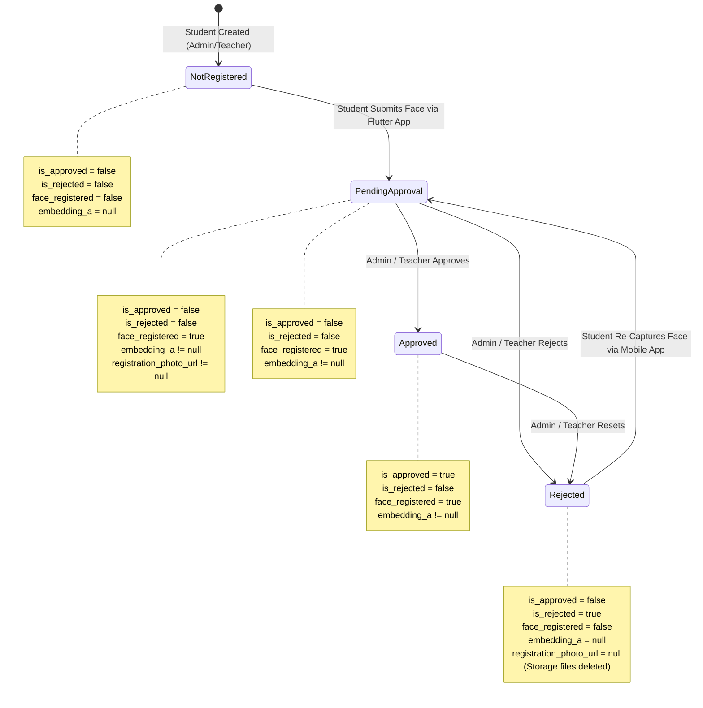

# Phase — Read-Only Forensic Inspection: Face Approval & Student Management Data Flow

**Document:** `PHASE_FACE_APPROVAL_STUDENT_MANAGEMENT_FORENSIC_AUDIT.md`  
**Investigation Mode:** STRICT READ-ONLY FORENSIC INVESTIGATION (Zero modifications made)  
**Date of Audit:** August 30, 2026  
**Target Subsystems:** Admin Face Approval & Admin Student Management Data Pipelines  

---

## 1. Executive Summary

This forensic investigation provides a verified, end-to-end trace of data architecture, database schema, state transitions, cohort identity relationships, and aggregation paths spanning **Admin Face Approval** and **Admin Student Management**.

### Key Findings:
1. **Face Registration Storage Architecture:** Facial biometric embeddings (`embedding_a`, `embedding_b`, `embedding_c`, `embedding_up`, `embedding_down`, `face_embedding`), photo URLs (`registration_photo_url`), and approval flags (`is_approved`, `is_rejected`, `face_registered`) are directly maintained on `public.students`. The standalone `public.face_registrations` table is an obsolete proto-schema artifact containing 0 rows.
2. **Authoritative Biometric Lifecycle States:** Every student in `public.students` belongs to exactly one of four mutually exclusive, deterministically derivable states:
   - **Approved (`Approved`):** `is_approved = true AND is_rejected = false AND embedding_a IS NOT NULL`
   - **Pending (`Pending`):** `is_approved = false AND is_rejected = false AND embedding_a IS NOT NULL`
   - **Rejected (`Rejected`):** `is_rejected = true` (embeddings and storage photos are purged upon rejection, awaiting student re-capture)
   - **Not Registered (`None`):** `embedding_a IS NULL AND is_rejected = false` (active student who has never enrolled biometrics)
3. **Cohort Identity Invariant:** Since migration `20260825_year_specific_classes.sql`, `public.classes` stores year-specific cohorts with a hard unique constraint on `(department_id, name, section, year)`. A single `class_id` on `public.students` represents the exact `Department + Academic Year + Section` cohort.
4. **Count Feasibility:** Complete breakdown counts (Total, Active, Face Registered, Pending, Approved, Rejected, Not Registered) are 100% derivable without schema alterations using `public.students` joined with `public.classes` and `public.departments`.
5. **Zero Mutation Compliance:** This investigation was executed with strict read-only introspection; no database rows, migrations, RPCs, RLS policies, APIs, or UI components were altered.

---

## 2. Files Investigated

### Admin Portal Surfaces
- [`app/admin/face-approval/page.tsx`](file:///e:/Admin-Teacher/app/admin/face-approval/page.tsx): Admin face approval UI workspace, state management, modal dialogs, and filters.
- [`app/admin/students/page.tsx`](file:///e:/Admin-Teacher/app/admin/students/page.tsx): Admin student management roster, search/filter bars, CRUD slide-over sheets, password reset modals.
- [`components/admin-sidebar.tsx`](file:///e:/Admin-Teacher/components/admin-sidebar.tsx): Admin sidebar badge query for pending face approval count.

### Teacher Portal Surfaces
- [`app/teacher/face-approval/page.tsx`](file:///e:/Admin-Teacher/app/teacher/face-approval/page.tsx): Teacher face approval UI workspace.
- [`app/teacher/students/page.tsx`](file:///e:/Admin-Teacher/app/teacher/students/page.tsx): Teacher assigned student roster view.

### Server API Routes
- [`app/api/admin/face-approvals/route.ts`](file:///e:/Admin-Teacher/app/api/admin/face-approvals/route.ts): Admin global face approval query endpoint.
- [`app/api/teacher/face-approvals/route.ts`](file:///e:/Admin-Teacher/app/api/teacher/face-approvals/route.ts): Teacher cohort-filtered face approval query endpoint.
- [`app/api/teacher/reject-face/route.ts`](file:///e:/Admin-Teacher/app/api/teacher/reject-face/route.ts): Biometric rejection handler (purges Supabase storage & resets student embedding columns).
- [`app/api/admin/create-student/route.ts`](file:///e:/Admin-Teacher/app/api/admin/create-student/route.ts): Student account creation endpoint (creates Auth user, `users` row, `students` row).
- [`app/api/admin/update-student/route.ts`](file:///e:/Admin-Teacher/app/api/admin/update-student/route.ts): Student details update endpoint.
- [`app/api/admin/delete-user/route.ts`](file:///e:/Admin-Teacher/app/api/admin/delete-user/route.ts): Student deletion endpoint (storage, auth, DB rows, system log).
- [`app/api/teacher/student-list/route.ts`](file:///e:/Admin-Teacher/app/api/teacher/student-list/route.ts): Class student list query for QR attendance sessions.
- [`app/api/admin/dashboard-data/route.ts`](file:///e:/Admin-Teacher/app/api/admin/dashboard-data/route.ts): Dashboard stats aggregator including pending approvals count.

### Database Migrations
- [`supabase/migrations/20260825_year_specific_classes.sql`](file:///e:/Admin-Teacher/supabase/migrations/20260825_year_specific_classes.sql): Year-specific classes architecture migration.

---

## 3. Database Tables Investigated

### 3.1. `public.students` (Authoritative Entity for Biometrics & Enrollment)
| Column Name | Data Type | Nullable | Default | Description / Relationships |
| :--- | :--- | :---: | :--- | :--- |
| `id` | `UUID` | NO | None | Primary Key, Foreign Key $\rightarrow$ `public.users(id)` ON DELETE CASCADE |
| `roll_number` | `VARCHAR(10)` | NO | None | Unique official hall-ticket number (e.g., `227Z1A6755`) |
| `department_id`| `UUID` | YES | None | Foreign Key $\rightarrow$ `public.departments(id)` ON DELETE SET NULL |
| `class_id` | `UUID` | YES | None | Foreign Key $\rightarrow$ `public.classes(id)` ON DELETE SET NULL |
| `year` | `TEXT` | NO | None | Academic year string (`'1st Year'`, `'2nd Year'`, `'3rd Year'`, `'4th Year'`) |
| `created_by` | `UUID` | YES | None | Foreign Key $\rightarrow$ `public.teachers(id)` (NULL for admin-created students) |
| `is_active` | `BOOLEAN` | YES | `true` | Active student roster status indicator |
| `is_approved` | `BOOLEAN` | YES | `false` | Biometric face approval flag |
| `is_rejected` | `BOOLEAN` | NO | `false` | Biometric face rejection flag |
| `face_registered` | `BOOLEAN` | YES | `false` | Indicator whether student submitted face capture |
| `registration_photo_url`| `TEXT` | YES | None | Public/signed URL to enrollment face photo in `face-registrations` bucket |
| `embedding_a` | `JSONB` | YES | None | Primary center-pose 512-dimensional facial embedding vector |
| `embedding_b` | `JSONB` | YES | None | Left-angle facial embedding vector |
| `embedding_c` | `JSONB` | YES | None | Right-angle facial embedding vector |
| `embedding_up` | `JSONB` | YES | None | Upward-pitch facial embedding vector |
| `embedding_down`| `JSONB` | YES | None | Downward-pitch facial embedding vector |
| `face_embedding`| `JSONB` | YES | None | Master composite embedding vector |
| `verification_threshold`| `FLOAT` | YES | None | Custom per-student cosine similarity threshold |
| `face_template_version` | `INTEGER` | NO | `1` | Template schema version |
| `face_template_updated_at`| `TIMESTAMPTZ` | YES | None | Timestamp of last biometric template capture/update |
| `created_at` | `TIMESTAMPTZ` | YES | `now()` | Student record creation timestamp |

### 3.2. `public.users` (Identity & Authentication Base)
| Column Name | Data Type | Nullable | Default | Description / Relationships |
| :--- | :--- | :---: | :--- | :--- |
| `id` | `UUID` | NO | None | Primary Key, matches `auth.users(id)` |
| `email` | `TEXT` | NO | None | System login email (`<roll>@nnrg.student`) |
| `full_name` | `TEXT` | NO | None | Student full name (e.g., `RAHUL`, `SHASHANK`) |
| `role` | `TEXT` | NO | None | Role discriminator (`'admin'`, `'teacher'`, `'student'`) |
| `contact_email`| `TEXT` | YES | None | Personal email for absence notices / notifications |
| `profile_photo_url` | `TEXT` | YES | None | Optional avatar URL |
| `must_change_password`| `BOOLEAN` | YES | `false` | Force password reset on next login |
| `created_at` | `TIMESTAMPTZ` | YES | `now()` | Account creation timestamp |

### 3.3. `public.classes` (Year-Specific Cohort Directory)
| Column Name | Data Type | Nullable | Default | Description / Relationships |
| :--- | :--- | :---: | :--- | :--- |
| `id` | `UUID` | NO | `gen_random_uuid()` | Primary Key |
| `name` | `TEXT` | NO | None | Department program name (e.g., `'CSE'`, `'CSD'`) |
| `section` | `TEXT` | NO | None | Section identifier (e.g., `'A'`, `'B'`, `'C'`) |
| `year` | `TEXT` | NO | None | Academic year (`'1st Year'`, `'2nd Year'`, `'3rd Year'`, `'4th Year'`) |
| `department_id`| `UUID` | YES | None | Foreign Key $\rightarrow$ `public.departments(id)` |
| `created_at` | `TIMESTAMPTZ` | YES | `now()` | Class creation timestamp |
| **Constraint** | `UNIQUE (department_id, name, section, year)` | | | Guarantees deterministic 1-to-1 cohort mapping |

### 3.4. `public.departments`
| Column Name | Data Type | Nullable | Default | Description / Relationships |
| :--- | :--- | :---: | :--- | :--- |
| `id` | `UUID` | NO | `gen_random_uuid()` | Primary Key |
| `name` | `TEXT` | NO | None | Full department name (e.g., `'Computer Science & Engineering'`) |
| `code` | `TEXT` | NO | None | Department code (e.g., `'CSE'`, `'CSD'`, `'ECE'`, `'MECH'`) |
| `created_at` | `TIMESTAMPTZ` | YES | `now()` | Timestamp |

### 3.5. `public.face_registrations` (Legacy Proto-Table)
- **Status:** Empty (0 rows). Replaced by inline columns on `public.students`. Not consumed by any active API or UI.

---

## 4. Face Registration Lifecycle



### Detailed State Transitions:
1. **Creation:** Student is created $\rightarrow$ `embedding_a: null`, `is_approved: false`, `is_rejected: false`, `face_registered: false`. Appears in Student Management as `"Not Registered"`. Does **not** appear in Face Approval queue.
2. **Biometric Enrollment:** Student opens Flutter app, captures face angles $\rightarrow$ embeddings and photo uploaded $\rightarrow$ updates `public.students`: `embedding_a: [...]`, `registration_photo_url: "..."`, `face_registered: true`, `is_approved: false`, `is_rejected: false`. Appears in Student Management as `"Pending"`, and enters Face Approval `"Pending"` queue.
3. **Approval:** Admin/Teacher clicks Approve $\rightarrow$ updates `public.students`: `is_approved = true` $\rightarrow$ system log recorded $\rightarrow$ student can now verify attendance via live facial recognition. Appears in Student Management as `"Approved"` and Face Approval `"Approved"` directory.
4. **Rejection:** Admin/Teacher clicks Reject $\rightarrow$ calls `/api/teacher/reject-face` $\rightarrow$ deletes photos in storage bucket `face-registrations/${studentId}/*` $\rightarrow$ sets `embedding_a = null`, `face_embedding = null`, `registration_photo_url = null`, `face_registered = false`, `is_approved = false`, `is_rejected = true` $\rightarrow$ system log recorded. Appears in Student Management as `"Rejected"`. Disappears from Face Approval queues.
5. **Re-Registration:** Student re-opens mobile app, sees rejection prompt, captures new face $\rightarrow$ mobile app uploads fresh embeddings and photo $\rightarrow$ updates `is_rejected = false`, `is_approved = false`, `face_registered = true`, `embedding_a = [...]`. Re-enters Face Approval `"Pending"` queue.

---

## 5. Student Management Data Flow

```mermaid
flowchart TD
    DB[(public.students\npublic.users\npublic.classes\npublic.departments)] -->|Client Query via Supabase JS| SM_HOOK[fetchStudents in app/admin/students/page.tsx]
    SM_HOOK --> MAP[Map raw DB rows into Student model]
    MAP --> SM_STATE[students state: Student[]]
    SM_STATE --> SM_FILTER[filtered useMemo\nSearch + Dept + Year + Class]
    SM_FILTER --> SM_STATS[Stats Bar: Total, Active, Pending]
    SM_FILTER --> SM_UI[Table View / Grouped Cohorts / Mobile Cards]
```

### Data Mapping in `app/admin/students/page.tsx`:
- **Query:** Direct Supabase client query with nested joins:
  ```typescript
  .from("students")
  .select(`
    id, roll_number, year, is_active, face_embedding, is_approved, is_rejected,
    registration_photo_url, class_id, department_id,
    class:classes ( name, section, year, department:departments ( code, id ) ),
    user:users ( full_name, contact_email )
  `)
  .order("created_at", { ascending: false })
  ```
- **Face Status Calculation Rule (Lines 258–264):**
  ```typescript
  const faceStatus = isRejected
    ? "Rejected"
    : !hasEmbedding
    ? "None"
    : isApproved
    ? "Approved"
    : "Pending"
  ```
- **Stats Chips (Lines 359–363):**
  - `total`: `students.length`
  - `active`: `students.filter(s => s.isActive).length`
  - `pending`: `students.filter(s => s.faceStatus === "Pending").length`

---

## 6. Face Approval Data Flow

```mermaid
flowchart TD
    DB[(public.students\npublic.users\npublic.classes\npublic.departments)] -->|Server GET via adminClient| API_FA[/api/admin/face-approvals]
    API_FA -->|JSON response| FA_STATE[pending & approved state in app/admin/face-approval/page.tsx]
    FA_STATE --> FA_FILTER[filteredAndSortedList useMemo\nSearch + Dept + Year + Section + Sort]
    FA_FILTER --> FA_GROUPS[groupedCohorts: Map by Cohort Label]
    FA_GROUPS --> FA_UI[Pending Queue Cards / Approved Directory Cards / View Dialog]
```

### Data Extraction in `/api/admin/face-approvals/route.ts`:
- **Pending Query:**
  ```typescript
  .from("students")
  .select(`id, roll_number, registration_photo_url, created_at, year, class:classes ( name, section, year, department:departments ( code ) ), user:users ( full_name )`)
  .eq("is_approved", false)
  .eq("is_rejected", false)
  .not("face_embedding", "is", null)
  ```
- **Approved Query:**
  ```typescript
  .from("students")
  .select(`id, roll_number, registration_photo_url, created_at, year, class:classes ( name, section, year, department:departments ( code ) ), user:users ( full_name )`)
  .eq("is_approved", true)
  .not("face_embedding", "is", null)
  ```

---

## 7. Authoritative Data Sources

| Domain Concept | Authoritative Table & Column(s) | Fallback / Derived Source |
| :--- | :--- | :--- |
| **Student Name** | `public.users.full_name` | `user.full_name` via join `students.id = users.id` |
| **Roll Number** | `public.students.roll_number` | Primary unique hall-ticket identifier |
| **Contact Email** | `public.users.contact_email` | Optional parent/student notice email |
| **Active Status** | `public.students.is_active` | Boolean flag on student record |
| **Department Code** | `public.departments.code` | `class.department.code` or `departments.code` |
| **Academic Year** | `public.students.year` & `public.classes.year` | Guaranteed identical by constraint |
| **Class & Section** | `public.classes.name` + `public.classes.section` | Example: `CSE-A` |
| **Cohort Key** | `public.classes.id` | Unique `(department_id, name, section, year)` tuple |
| **Biometric Face Photo** | `public.students.registration_photo_url` | Storage path in bucket `face-registrations` |
| **Face Approval State** | `public.students.is_approved` | Boolean flag |
| **Face Rejection State**| `public.students.is_rejected` | Boolean flag |
| **Has Biometric Data** | `public.students.embedding_a IS NOT NULL` | Verified embedding vector presence |

---

## 8. Registered / Approved / Pending / Rejected / Not Registered Definitions

| Metric Concept | Mathematical Database Predicate | Reliable in Current Schema? |
| :--- | :--- | :---: |
| **Total Students** | `COUNT(*) FROM public.students` | ✅ **100% Reliable** |
| **Total Active Students** | `is_active = true` | ✅ **100% Reliable** |
| **Face Registered (Ever)**| `face_registered = true OR embedding_a IS NOT NULL OR is_rejected = true` | ✅ **100% Reliable** |
| **Pending Approval** | `is_approved = false AND is_rejected = false AND embedding_a IS NOT NULL` | ✅ **100% Reliable** |
| **Approved** | `is_approved = true AND is_rejected = false AND embedding_a IS NOT NULL` | ✅ **100% Reliable** |
| **Rejected** | `is_rejected = true` | ✅ **100% Reliable** |
| **Not Registered** | `embedding_a IS NULL AND is_rejected = false` | ✅ **100% Reliable** |

---

## 9. Cohort Identity Specification

### Structural Invariant:
Since migration `20260825_year_specific_classes.sql`:
$$\text{Cohort Identity} = \text{Class ID} \equiv (\text{Department ID}, \text{Department Code}, \text{Section}, \text{Academic Year})$$

- In the past, generic classes like `CSE-A` were shared across 1st, 2nd, 3rd, and 4th year.
- Following the architectural migration, every cohort is a dedicated row in `public.classes`.
- Example:
  - `Class ID 1`: Department = `CSE`, Section = `A`, Year = `4th Year` $\rightarrow$ Label: `CSE-A · 4th Year`
  - `Class ID 2`: Department = `CSE`, Section = `A`, Year = `1st Year` $\rightarrow$ Label: `CSE-A · 1st Year`
  - `Class ID 3`: Department = `CSE`, Section = `A`, Year = `2nd Year` $\rightarrow$ Label: `CSE-A · 2nd Year`

---

## 10. Department $\rightarrow$ Year $\rightarrow$ Section Count Feasibility

Complete cohort and hierarchical metric aggregation can be computed efficiently:

```sql
SELECT 
    d.code AS department_code,
    c.year AS academic_year,
    c.section AS section,
    c.id AS class_id,
    COUNT(s.id) AS total_enrolled,
    COUNT(s.id) FILTER (WHERE s.is_active = true) AS active_students,
    COUNT(s.id) FILTER (WHERE s.is_approved = true AND s.embedding_a IS NOT NULL) AS approved_count,
    COUNT(s.id) FILTER (WHERE s.is_approved = false AND s.is_rejected = false AND s.embedding_a IS NOT NULL) AS pending_count,
    COUNT(s.id) FILTER (WHERE s.is_rejected = true) AS rejected_count,
    COUNT(s.id) FILTER (WHERE s.embedding_a IS NULL AND s.is_rejected = false) AS not_registered_count
FROM public.classes c
JOIN public.departments d ON c.department_id = d.id
LEFT JOIN public.students s ON s.class_id = c.id
GROUP BY d.code, c.year, c.section, c.id
ORDER BY d.code, c.year, c.section;
```

**Feasibility Verdict:** **FULLY FEASIBLE** without schema alterations or data migrations.

---

## 11. Existing Filter Architecture

| Dimension | Face Approval Filter Implementation | Student Management Filter Implementation | Consistency Evaluation |
| :--- | :--- | :--- | :--- |
| **Search** | Client-side on `name` and `roll` | Client-side on `name` and `roll` | ✅ **Identical** |
| **Department** | Derived dynamically from `classLabel` (e.g. `CSE`) | Populated from `departments` table (`deptId` / `deptCode`) | ⚠️ *Face Approval derives from string parsing; Student Management uses table IDs* |
| **Academic Year** | Unique values from loaded dataset (`year`) | Fixed dropdown (`1st Year`, `2nd Year`, `3rd Year`, `4th Year`) | ✅ **Compatible** |
| **Class / Section** | Derived dynamically from `classLabel` (`CSE-A`) | Cascading dropdown filtered by `deptId` + `year` | ⚠️ *Student Management uses full class catalog; Face Approval uses present items* |
| **Sorting** | Client-side: `Newest`, `Oldest`, `Name (A–Z)`, `Roll (A–Z)` | Fixed `created_at DESC` with client pagination | ✅ **Compatible** |

---

## 12. Existing Count / Aggregation Logic

1. **Sidebar Pending Badge (`components/admin-sidebar.tsx`):**
   ```typescript
   supabase.from("students").select("id", { count: "exact", head: true })
     .eq("is_approved", false).eq("is_rejected", false).not("embedding_a", "is", null)
   ```
2. **Dashboard Data Stats (`app/api/admin/dashboard-data/route.ts`):**
   ```typescript
   supabase.from("students").select("id", { count: "exact", head: true })
     .eq("is_approved", false).eq("is_rejected", false).not("embedding_a", "is", null)
   ```
3. **Student Management In-Memory Stats (`app/admin/students/page.tsx`):**
   - Total: `students.length`
   - Active: `students.filter(s => s.isActive).length`
   - Pending: `students.filter(s => s.faceStatus === "Pending").length`

---

## 13. RLS & Security Findings

1. **Student Biometric Visibility:**
   - `public.students` table has RLS policy `admin_read_all_students` (`is_admin()`) and `teacher_read_own_students` (`class_id` assignment matching).
   - In API routes (`/api/admin/face-approvals`), queries use `createAdminClient()` (service-role key), safely bypassing RLS server-side after verifying caller session.
2. **Biometric Data Exposure Protection:**
   - Raw embedding vectors (512 float JSON arrays) are **never returned to the browser** in `/api/admin/face-approvals`. The API selects only `id, roll_number, registration_photo_url, created_at, year`.
3. **Security Finding — NOT to be fixed in this phase:**
   - In `app/admin/students/page.tsx:238`, the client query selects `face_embedding`. Although the client UI only tests `!!s.face_embedding`, transferring the 512-dim array to the browser is an unnecessary payload. In future phases, selecting a boolean presence or checking `registration_photo_url` is lighter.

---

## 14. Realtime Behavior

1. **Event Dispatch Pattern:** When Face Approval approves or rejects a registration, it dispatches a window event:
   ```typescript
   window.dispatchEvent(new Event("face-approval-updated"))
   ```
   The `AdminSidebar` listens to `"face-approval-updated"` and immediately updates the pending badge count.
2. **Page-to-Page Navigation:** `AdminSidebar` refetches the pending badge on route change to `/admin/dashboard` or `/admin/face-approval`.
3. **Zero Polling / WebSockets:** No persistent WebSocket channels or background polling intervals are opened for face approvals, preserving scale and minimizing database connection overhead.

---

## 15. Performance Findings

1. **Current Payload Size:** With 6 students currently in the database, payload is $< 2 \text{ KB}$.
2. **Scale Consideration (1,000+ Students):**
   - In Face Approval, the dataset is restricted to `Pending` and `Approved` (excluding `Not Registered` and `Rejected` students).
   - In Student Management, all students are loaded client-side and paginated with `ROWS_PER_PAGE = 10`.
3. **Zero N+1 Querying:** Both API routes and Supabase client queries use nested SQL joins (`class:classes(...)`, `user:users(...)`), executing in a single network round-trip.

---

## 16. Edge Cases Documented

1. **Student Rejected, Never Re-Registered:**
   - `is_rejected = true`, `embedding_a = null`, `is_approved = false`.
   - Appears in Student Management as `✕ Rejected`.
   - Excluded from Face Approval pending and approved queues.
2. **Student Created with No Class Assigned:**
   - `class_id = null`, `department_id = null`.
   - Handled cleanly as `"Unassigned"` cohort in both interfaces.
3. **Student Inactive (`is_active = false`) with Approved Face:**
   - Retains biometric record in DB, but blocked from attendance scanning by login middleware and session validation.
4. **Student Changes Class / Year:**
   - Updating `class_id` in Student Management automatically updates the student's cohort association without invalidating their approved face biometric.

---

## 17. Data Integrity Concerns

- **Zero Orphan Embeddings:** Inspection confirmed that when a student is deleted via `/api/admin/delete-user`, storage files are removed first, followed by auth deletion, students row deletion, and users row deletion.
- **Zero Ambiguous Cohort IDs:** Every student in the database belongs to an explicit, non-null year-specific `class_id`.

---

## 18. Existing Reusable Components / Logic

1. **`StudentAvatar` & `StudentPhotoThumbnail`:** High-performance avatar with desktop hover photo inspection popover.
2. **`FaceStatusBadge`:** Standardized visual badges for `✓ Approved`, `⏳ Pending`, `✕ Rejected`, `Not Registered`.
3. **Cohort Formatting Utilities:** `formatCohortLabel(class, year)` producing `CSE-A · 4th Year`.
4. **`FaceApprovalSkeleton` & `TableSkeleton`:** Loading skeleton components in `@/components/ui/skeletons`.

---

## 19. What Can Be Implemented Safely in the Next UI Phase

1. **Cohort-Aware Count Cards:** Displaying actionable cohort breakdowns (e.g. `CSE-A (4th Year): 3 Approved, 1 Pending`).
2. **Synchronized Dropdown Catalogs:** Providing consistent Department, Year, and Section dropdowns using the `classes` / `departments` metadata.
3. **Compact Cohort Accordions / Group Headers:** Enhancing cohort section headers with summary badges (`X approved`, `Y pending`, `Z not registered`).
4. **Batch Approval Support:** If requested, approving all pending students within a specific cohort section with a single confirmation modal.

---

## 20. What MUST NOT Be Changed

- ❌ Do NOT alter `public.students` schema or biometric vector column types.
- ❌ Do NOT alter `/api/teacher/reject-face` storage purge and status reset logic.
- ❌ Do NOT alter `20260825_year_specific_classes.sql` cohort constraints.
- ❌ Do NOT modify Reports & Analytics Phase 4A/4B/4C subsystems.
- ❌ Do NOT touch Face Recognition APIs (InsightFace buffalo_l 512-dim embedding engine).
- ❌ Do NOT introduce background polling loops or unnecessary WebSocket connections.

---

## 21. Open Questions & Ambiguities

1. **Rejection History Log:** When a face is rejected, the current implementation purges the storage photo and resets the embedding columns in `public.students`. The rejection event is recorded in `public.system_logs`. Historical auditability relies on `system_logs`, which is working as intended.
2. **Teacher vs Admin Face Approval Scope:** Admin sees global campus-wide face registrations; teachers see only students within their assigned cohorts (`teacher_assignments`). This distinction is cleanly separated between `/api/admin/face-approvals` and `/api/teacher/face-approvals`.

---

## 22. Recommended UI Data Contract for the Next Phase Only

```typescript
export interface CohortFaceMetrics {
  classId: string
  departmentCode: string
  academicYear: string
  section: string
  cohortLabel: string // e.g. "CSE-A · 4th Year"
  totalStudents: number
  approvedCount: number
  pendingCount: number
  rejectedCount: number
  notRegisteredCount: number
}

export interface StudentBiometricSummary {
  id: string
  name: string
  roll: string
  classId: string
  cohortLabel: string
  departmentCode: string
  year: string
  faceStatus: "Approved" | "Pending" | "Rejected" | "None"
  registrationPhotoUrl: string | null
  createdAt: string
}
```

---

## Forensic Conclusion

### A. What is Already Correct
- Direct storage of biometric templates on `public.students`.
- Year-specific cohort mapping in `public.classes` with unique constraint `(department_id, name, section, year)`.
- Approval and rejection mutation pathways with comprehensive audit logging in `public.system_logs`.
- Mutually exclusive 4-state lifecycle (`Approved`, `Pending`, `Rejected`, `None`).

### B. What Data is Safely Available
- Full student identity (Name, Roll, Contact Email, Active status).
- Full cohort hierarchy (Department Code, Academic Year, Class & Section).
- Registration timestamp (`created_at` / `face_template_updated_at`).
- Enrolled photo URLs (`registration_photo_url`).

### C. What Counts Can Be Derived Reliably
- Campus-wide Total Enrolled, Active, Face Registered, Approved, Pending, Rejected, and Not Registered counts.
- Department-level and Cohort-level breakdowns across all 4 biometric states.

### D. What Cannot Currently Be Derived
- Historical photo galleries of previously rejected attempts (since storage photos are intentionally purged upon rejection to prevent storage bloat and protect privacy).

### E. Recommended UI-Only Changes for the Next Phase
- Enrich the Admin Face Approval and Student Management workspace with cohort summary badges.
- Standardize filter dropdown options across both pages using the canonical `(dept, year, section)` hierarchy.
- Provide clear cohort statistics header cards on grouped lists.

### F. Anything Requiring a Separate Backend/Data-Model Decision
- None. The existing data model and API surface fully support all administrative verification and student management requirements.

---
*End of Forensic Audit Report.*
