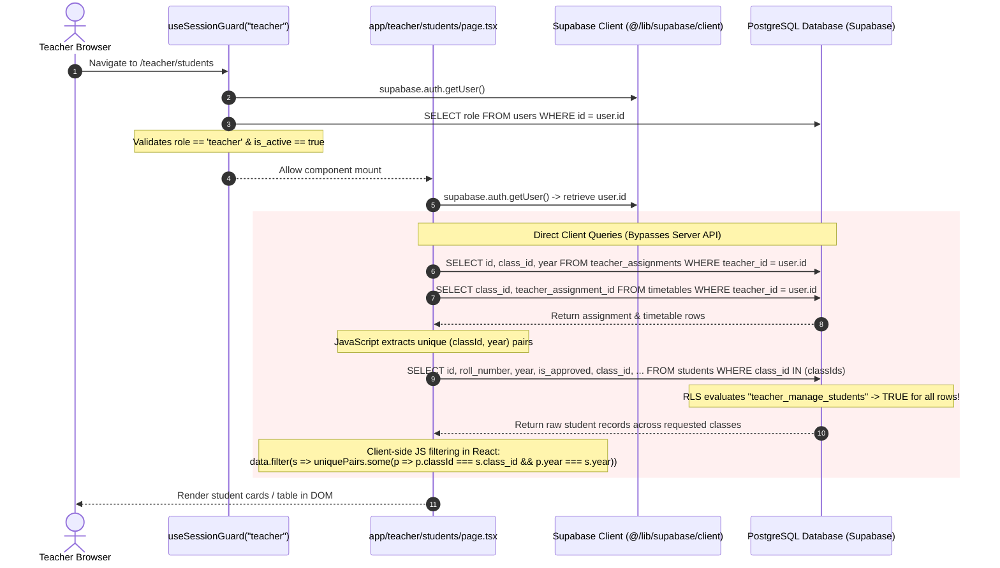
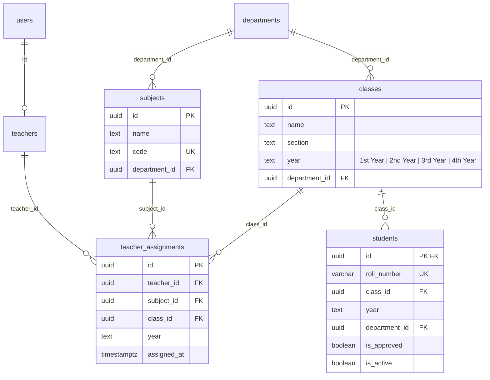

# TEACHER STUDENTS ACCESS CONTROL — READ-ONLY FORENSIC INVESTIGATION REPORT

**Document Version:** 1.0.0  
**Audit Date:** August 30, 2026  
**Investigation Mode:** READ-ONLY FORENSIC INVESTIGATION (Zero Code/Database Modifications)  
**Target Focus:** Teacher Portal — Students Access Control & Data-Access Architecture (`/teacher/students`)

---

## 1. Executive Summary

This forensic audit was conducted to investigate how the current application determines student visibility and enforces access control within the Teacher Portal, specifically for the **Teacher → Students** section (`/teacher/students`). 

### Core Forensic Findings:
1. **Frontend-Dominated Access Control:**
   The Teacher Students page ([app/teacher/students/page.tsx](file:///e:/Admin-Teacher/app/teacher/students/page.tsx)) does **not** consume a secure, server-side API. Instead, it queries the Supabase database directly from the client browser using the public anonymous client (`@/lib/supabase/client`). It retrieves assignment rows, derives `class_id`s in JavaScript, queries the `students` table, and executes an in-memory `.filter()` in client React code.
2. **Critical Database Row-Level Security (RLS) Vulnerability:**
   PostgreSQL RLS on `public.students` contains an open policy:
   ```sql
   CREATE POLICY "teacher_manage_students" ON public.students
     FOR ALL TO public
     USING (is_teacher()) WITH CHECK (is_teacher());
   ```
   Because PostgreSQL combines permissive RLS policies with Boolean `OR` logic, this policy **grants every authenticated teacher complete `SELECT`, `INSERT`, `UPDATE`, and `DELETE` access to all students across the entire institution**, regardless of department, year, section, or assignment.
3. **Unauthenticated, Unrestricted Server Route (`/api/teacher/student-list`):**
   The endpoint [app/api/teacher/student-list/route.ts](file:///e:/Admin-Teacher/app/api/teacher/student-list/route.ts) (used during active QR attendance) initializes a Supabase Admin client with `SUPABASE_SERVICE_ROLE_KEY`. It contains **no authentication check** (`auth.getUser()` is never called), **no role verification**, and **no assignment verification**. Any client can pass an arbitrary `class_id` in the URL query string and receive full student rosters (UUID, full name, roll number, attendance status).
4. **Authoritative Database Cohort Model (`class_id` = Specific Cohort):**
   Following the schema migration in [supabase/migrations/20260825_year_specific_classes.sql](file:///e:/Admin-Teacher/supabase/migrations/20260825_year_specific_classes.sql), the `public.classes` table enforces `UNIQUE (department_id, name, section, year)`. Therefore, `classes.id` (`class_id`) **uniquely and unambiguously identifies an exact cohort** (e.g., `CSE-A 1st Year` is `e86e547e...`, while `CSE-A 4th Year` is `6a999b80...`).
5. **No Database Schema Changes Required:**
   The existing database tables (`classes`, `teacher_assignments`, `students`, `teachers`, `users`) already possess the exact foreign keys and relational integrity needed to implement clean, server-side, assignment-bound access control without modifying tables or column definitions.

---

## 2. Current Teacher Students Architecture

The diagram below illustrates the end-to-end request and data flow for the Teacher Students page:



### Component & File Trace:
- **Page Route:** `app/teacher/students/page.tsx`
- **Component:** `TeacherStudentsPage` (Client Component marked `"use client"`)
- **Layout & Protection:** `app/teacher/layout.tsx` invokes `useSessionGuard("teacher")` from `hooks/use-session-guard.ts`.
- **API Routes Used by Page:** **NONE**. The page makes zero HTTP calls to internal `/api/*` routes.
- **Data Origin:** Direct client-side calls to `supabase.from("teacher_assignments")`, `supabase.from("timetables")`, and `supabase.from("students")`.

---

## 3. Authentication → Teacher Identity Flow

```mermaid
flowchart TD
    AuthToken[Supabase Auth JWT Token] --> AuthUID[auth.uid()]
    AuthUID --> UsersTable["public.users (id, role, full_name, email)"]
    UsersTable --> RoleCheck{"users.role == 'teacher'"}
    RoleCheck -- Yes --> TeachersTable["public.teachers (id, teacher_id_code, department_id, is_active)"]
    TeachersTable --> ActiveCheck{"teachers.is_active == true"}
    ActiveCheck -- Yes --> Assignments["public.teacher_assignments (teacher_id = auth.uid())"]
    RoleCheck -- No --> Deny[Access Denied]
    ActiveCheck -- No --> Disabled[Teacher Account Disabled]
```

### Trace of Identity & Authorization Functions:
1. **`auth.uid()`**: Derived from the authenticated Supabase session (stored in tab `sessionStorage` via `lib/supabase/client.ts` or incoming Bearer header).
2. **`public.users`**:
   - `id`: UUID (Primary Key, references `auth.users.id`).
   - `role`: `'admin' | 'teacher' | 'student'`.
3. **`public.teachers`**:
   - `id`: UUID (Primary Key, references `public.users.id`).
   - `teacher_id_code`: e.g. `'TCH007'`.
   - `is_active`: Boolean flag.
4. **Database Identity Helper Functions**:
   - `is_teacher()` SQL routine:
     ```sql
     SELECT EXISTS (
       SELECT 1 FROM public.users
       WHERE id = auth.uid() AND role = 'teacher'
     );
     ```
   - `is_admin()` SQL routine:
     ```sql
     SELECT EXISTS (
       SELECT 1 FROM public.users
       WHERE id = auth.uid() AND role = 'admin'
     );
     ```

---

## 4. Teacher Assignment Data Model

Inspected via Supabase MCP tool calls (`list_tables`, `execute_sql`).



### Table Specifications:
1. **`public.teacher_assignments`**:
   - `id`: `uuid` (Primary Key, `gen_random_uuid()`)
   - `teacher_id`: `uuid` (Foreign Key → `public.teachers.id`)
   - `subject_id`: `uuid` (Foreign Key → `public.subjects.id`)
   - `class_id`: `uuid` (Foreign Key → `public.classes.id`)
   - `year`: `text` (Check constraint: `'1st Year'`, `'2nd Year'`, `'3rd Year'`, `'4th Year'`)
   - `assigned_at`: `timestamptz`
   - **Unique Constraint:** `teacher_assignments_teacher_subject_class_year_key` (`teacher_id`, `subject_id`, `class_id`, `year`)
2. **`public.classes`**:
   - `id`: `uuid` (Primary Key)
   - `name`: `text` (e.g. `'CSE'`)
   - `section`: `text` (e.g. `'A'`)
   - `year`: `text` (`NOT NULL`, e.g. `'4th Year'`)
   - `department_id`: `uuid` (Foreign Key → `public.departments.id`)
   - **Unique Constraint:** `classes_dept_name_section_year_key` (`department_id`, `name`, `section`, `year`)
3. **`public.students`**:
   - `id`: `uuid` (Primary Key, Foreign Key → `public.users.id`)
   - `roll_number`: `varchar` (Unique Key, e.g. `'227Z1A6755'`)
   - `class_id`: `uuid` (Foreign Key → `public.classes.id`)
   - `year`: `text` (Matches `classes.year`)
   - `department_id`: `uuid` (Foreign Key → `public.departments.id`)
   - `is_approved`: `boolean`
   - `is_active`: `boolean`

---

## 5. Subject → Class → Section Relationship

### Academic Model Semantics:
In this institution model, **students are enrolled in cohorts (Class + Section + Year), not individual subject electives**.
- A class record represents a specific group of students (e.g., all students in `CSE-A · 4th Year`).
- Multiple teachers are assigned to teach different subjects to the *same* cohort.
- Example from live database:
  - `CSE-A · 4th Year` (`class_id = 6a999b80-1229-482b-ae81-e9632466eb98`) has the following active assignments:
    1. **Teacher Venu** (`c7e0c742...`): *Software Engineering* (`80136e27...`)
    2. **Teacher Priyanka** (`148b5844...`): *Predictive Analytics* (`4e13e03b...`)
    3. **Teacher Ram** (`bdd8674c...`): *Operating Systems* (`8969828d...`)
    4. **Teacher Devi** (`ef2dacca...`): *Machine Learning* (`72795586...`) & *Computer Networks* (`daa732db...`)

### Concrete Database Inspection:
| Teacher Name | Teacher ID | Subject Assigned | Assigned Class (Cohort) | Academic Year | Class UUID (`class_id`) |
| :--- | :--- | :--- | :--- | :--- | :--- |
| **Devi** | `ef2dacca...` | Computer Networks | CSE - A | 1st Year | `e86e547e-936b-4173-9148-af260f0e3631` |
| **Devi** | `ef2dacca...` | Machine Learning | CSE - A | 4th Year | `6a999b80-1229-482b-ae81-e9632466eb98` |
| **Devi** | `ef2dacca...` | Computer Networks | CSE - A | 4th Year | `6a999b80-1229-482b-ae81-e9632466eb98` |
| **Venu** | `c7e0c742...` | Software Engineering | CSE - A | 4th Year | `6a999b80-1229-482b-ae81-e9632466eb98` |
| **Priyanka** | `148b5844...` | Predictive Analytics | CSE - A | 4th Year | `6a999b80-1229-482b-ae81-e9632466eb98` |
| **Ram** | `bdd8674c...` | Operating Systems | CSE - A | 4th Year | `6a999b80-1229-482b-ae81-e9632466eb98` |

### Multi-Assignment Capabilities:
- **Same Subject, Multiple Cohorts:** Supported (e.g. Teacher Devi teaching Computer Networks to both 1st Year and 4th Year).
- **Multiple Subjects, Same Cohort:** Supported (e.g. Teacher Devi teaching both Machine Learning and Computer Networks to `CSE-A · 4th Year`).
- **Multiple Years:** Supported via separate `classes.id` UUIDs per academic year.

---

## 6. Current Student Query

### Actual Implementation in `app/teacher/students/page.tsx`:
```typescript
// 1. Fetch teacher assignments
const { data: assignmentRows } = await supabase
  .from("teacher_assignments")
  .select("id, class_id, year, class:classes ( year )")
  .eq("teacher_id", teacherId)

// 2. Fetch timetable slots
const { data: timetableRows } = await supabase
  .from("timetables")
  .select(`class_id, teacher_assignment_id, class:classes ( year ), teacher_assignment:teacher_assignments ( id, class_id, year, class:classes ( year ) )`)
  .eq("teacher_id", teacherId)

// 3. Extract unique classIds in JavaScript
const assignedPairs = []
// ... loops over assignmentRows and timetableRows ...
const uniquePairs = Array.from(new Set(assignedPairs.map((p) => `${p.classId}:::${p.year}`)))
const classIds = [...new Set(uniquePairs.map((p) => p.classId))]

// 4. Query students table directly
const { data, error } = await supabase
  .from("students")
  .select(`
    id, roll_number, year, is_active, embedding_a, is_approved, is_rejected,
    registration_photo_url, class_id,
    class:classes ( name, section, year, department:departments ( code ) ),
    user:users ( full_name )
  `)
  .in("class_id", classIds)
  .order("created_at", { ascending: false })

// 5. JavaScript in-memory filter
const matchingStudents = (data || []).filter((s: any) =>
  uniquePairs.some((p) => p.classId === s.class_id && p.year === s.year)
)
```

### Analysis of Filtering Restraints:
- **Teacher ID:** Evaluated client-side when querying `teacher_assignments`.
- **Assignment ID:** Not used in student query.
- **Subject ID:** Not evaluated in student query (correct for cohort student listing).
- **Class ID:** Passed in `.in("class_id", classIds)`.
- **Academic Year:** Filtered in **client-side JavaScript** (`matchingStudents.filter(...)`).
- **Department:** Inherited from `classes.department_id`.

---

## 7. API Security Audit

### 1. `/api/teacher/student-list` ([app/api/teacher/student-list/route.ts](file:///e:/Admin-Teacher/app/api/teacher/student-list/route.ts)):
| Security Check | Status | Analysis |
| :--- | :--- | :--- |
| **Authenticates Request?** | **FAIL** | Does not read cookies or Authorization headers. `auth.getUser()` is never called. |
| **Verifies User Role?** | **FAIL** | No role check exists. |
| **Derives Teacher ID from Session?** | **FAIL** | Completely unaware of who the caller is. |
| **Accepts Arbitrary `class_id`?** | **FAIL (CRITICAL)** | Directly accepts `searchParams.get("class_id")` and executes `.eq("class_id", classId)` using service role key. |
| **Accepts Arbitrary `session_id`?** | **FAIL** | Accepts `searchParams.get("session_id")` without verifying session ownership. |
| **Exposes Student PII?** | **FAIL** | Returns student IDs, full names, and roll numbers to any caller. |

### 2. Other Teacher APIs:
- **`/api/teacher/face-approvals`**: Accepts `?teacher_id=` from searchParams; does not authenticate that the caller matches `teacher_id`.
- **`/api/teacher/reject-face`**: Accepts `studentId` in POST body and deletes storage files/embeddings via admin client without checking teacher assignment.
- **`/api/teacher/reset-student-password`**: Accepts `student_id` in POST body and resets password without checking teacher assignment.
- **`/api/teacher/save-missed-attendance`**: Accepts `class_id` in POST body and inserts sessions/attendance without verifying teacher assignment to that `class_id`.

---

## 8. RLS / Database Authorization Analysis

Full audit of `pg_policies` for relevant tables in `public` schema:

### 1. `public.students` Table:
```sql
-- POLICY A: The Overly Permissive Policy (VULNERABILITY)
-- Command: ALL (SELECT, INSERT, UPDATE, DELETE)
-- Roles: public (all authenticated users with role='teacher')
CREATE POLICY "teacher_manage_students" ON public.students
  FOR ALL TO public
  USING (is_teacher())
  WITH CHECK (is_teacher());

-- POLICY B: The Intended Scoped Policy (Ineffective because Policy A is OR'ed with it)
CREATE POLICY "teacher_read_own_students" ON public.students
  FOR SELECT TO public
  USING (EXISTS (
    SELECT 1 FROM public.teacher_assignments ta
    WHERE ta.teacher_id = auth.uid() AND ta.class_id = students.class_id
  ));

-- POLICY C: Admin Full Access
CREATE POLICY "admin_read_all_students" ON public.students
  FOR SELECT TO public
  USING (is_admin());
```

### 2. Policy Evaluation Mechanics:
In PostgreSQL RLS:
$$\text{Access Granted} \iff \text{Policy A} \lor \text{Policy B} \lor \text{Policy C}$$
Because `teacher_manage_students` evaluates to `TRUE` for any teacher, `Policy B` (`teacher_read_own_students`) is completely bypassed. A teacher can open browser DevTools and execute:
```javascript
const { data } = await supabase.from('students').select('*');
```
and receive **all student records across the institution**.

---

## 9. Current Data Exposure Analysis

```
Current Security Mechanism:
[PostgreSQL Database] ──(All Students Exposed via RLS)──> [Browser Client] ──(Hidden by React .filter())──> [UI Screen]
```

### Verdict:
**SECURITY ISSUE — DATA EXPOSED BEFORE UI FILTERING**

1. The server and database currently permit any teacher to access all students.
2. The restriction to assigned cohorts occurs purely in the React component's in-memory array filtering (`.filter()`).
3. An attacker with a teacher login can inspect network payloads or query Supabase directly to view unassigned classes, sections, and years.

---

## 10. Admin vs Teacher Permission Boundary

| Feature / Data Entity | Admin Scope | Teacher Scope (Intended) | Teacher Scope (Current Actual) |
| :--- | :--- | :--- | :--- |
| **All Students List** | Campus-wide (All departments, years, sections) | **NONE** (Must only access assigned cohorts) | **Campus-wide** (via RLS leak & API query manipulation) |
| **Assigned Cohort Students** | Full access | Read & Mark Attendance | Read & Mark Attendance |
| **Unassigned Cohorts** | Full access | **ZERO ACCESS** | Readable via direct Supabase SDK |
| **Face Approval** | Campus-wide approval / reject | Only students in assigned classes | Can reject any student ID via `/api/teacher/reject-face` |
| **Password Reset** | Campus-wide reset | Only students in assigned classes | Can reset any student ID via `/api/teacher/reset-student-password` |
| **Academic Structure** | Create/Edit/Delete Depts, Classes, Subjects | View-only for assigned classes | View-only |
| **Timetable / Assignments**| Manage all teacher assignments | View own timetable | View own timetable |

---

## 11. Cross-Cohort Security Cases

Concrete assessment of the 7 security test cases against current codebase:

| Case | Scenario | Current Result | Vulnerability Status |
| :--- | :--- | :--- | :--- |
| **Case 1** | Teacher A (`CSE-A · 4th Year`) queries `CSE-B · 4th Year` | UI hides it; Database SDK / API returns it. | **VULNERABLE** |
| **Case 2** | Teacher A (`CSE-A · 4th Year`) queries `CSE-A · 1st Year` (same name, diff year) | UI hides it; Database SDK / API returns it. | **VULNERABLE** |
| **Case 3** | Teacher A (`CSE-A · 4th Year`) queries `ECE-A · 1st Year` (diff department) | UI hides it; Database SDK / API returns it. | **VULNERABLE** |
| **Case 4** | Teacher A queries students assigned exclusively to Teacher B | UI hides it; Database SDK / API returns it. | **VULNERABLE** |
| **Case 5** | Teacher A manipulates `class_id` in `/api/teacher/student-list` | API returns the manipulated cohort's students without error. | **VULNERABLE** |
| **Case 6** | Teacher A teaches two cohorts (e.g. 1st Yr + 4th Yr) | UI returns both; but SDK also has access to 2nd & 3rd Yr. | **PARTIALLY RESTRICTED (UI Only)** |
| **Case 7** | Duplicate assignments to same cohort (e.g. 2 subjects for CSE-A 4th Yr) | UI uses `uniquePairs` to avoid duplicate cards. | **CORRECT IN UI** |

---

## 12. Student Cohort Identity

### Authoritative Cohort Identifier:
The **`classes.id` (`class_id`) column is the single canonical cohort identifier**.

### Evidence from Database Schema & Migration:
1. Migration `20260825_year_specific_classes.sql` permanently restructured `public.classes`:
   ```sql
   ALTER TABLE public.classes ADD CONSTRAINT classes_dept_name_section_year_key 
       UNIQUE (department_id, name, section, year);
   ```
2. Every class row now uniquely encapsulates:
   - `department_id` (e.g. Computer Science)
   - `name` (e.g. `CSE`)
   - `section` (e.g. `A`)
   - `year` (e.g. `4th Year`)
3. `students.class_id` references `classes.id`.
4. `teacher_assignments.class_id` references `classes.id`.
5. Therefore, no composite key (e.g. `name + section + year`) is needed. Matching `teacher_assignments.class_id = students.class_id` inherently guarantees exact Department + Section + Year isolation.

---

## 13. Edge Cases

| Edge Case | Expected System Behavior | Current System Behavior |
| :--- | :--- | :--- |
| **Teacher with No Assignments** | Students page displays empty state ("No students in your assigned classes yet.") | Correctly displays empty state in UI, but SDK can still query all students. |
| **Teacher with Multiple Assignments (Same Cohort)** | Returns union of students with zero duplicate cards/rows. | Correct in UI; deduplicated via Set in JavaScript. |
| **Teacher Assigned to Multiple Years** | Returns students from both assigned years; excludes unassigned years. | Correct in UI; unassigned years exposed at database layer. |
| **Inactive / Disabled Teacher (`is_active = false`)** | Blocked at login / session guard; redirected to `/login?error=disabled`. | Correctly enforced in `useSessionGuard.ts`. |
| **Assignment Deleted While Teacher Logged In** | On next page load or API fetch, revoked cohort immediately disappears. | UI re-fetches assignments on mount; immediate reflection. |
| **Student Moved to Another Cohort (`class_id` updated)** | Student immediately disappears from old teacher's view and appears in new teacher's view. | Handled automatically by `class_id` foreign key. |
| **Inactive Student (`is_active = false`)** | Excluded from active student count and attendance roster. | Admin can toggle active status; teacher UI displays active status. |

---

## 14. Performance Audit

1. **Current Payload & Query Overhead:**
   - On `/teacher/students`, the client makes **3 separate sequential/parallel roundtrips** from the browser to Supabase:
     1. `teacher_assignments` fetch
     2. `timetables` fetch
     3. `students` bulk fetch with `.in("class_id", classIds)`
2. **Indexing:**
   - `classes.id` is indexed (Primary Key).
   - `students.class_id` is indexed (Foreign Key constraint).
   - `teacher_assignments.teacher_id` and `class_id` are indexed (Unique constraint).
   - Joins on `class_id` are highly optimized in PostgreSQL ($O(1)$ index scan).
3. **Payload Optimization Opportunity:**
   - Moving to a single server-side Route Handler (`/api/teacher/student-list`) reduces browser roundtrips from 3 to 1, executes joins within the co-located database connection, and transfers only sanitized, authorized data over the wire.

---

## 15. Existing Correct Authorization Patterns to Reuse

Several existing endpoints in the repository already demonstrate the correct, secure authorization pattern and should be used as the architectural template:

### 1. `app/api/teacher/dashboard/route.ts`:
```typescript
// Established Canonical Pattern:
const supabase = await createClient()
const { data: { user } } = await supabase.auth.getUser()
if (!user) return NextResponse.json({ error: "Unauthorized" }, { status: 401 })

// 1. Resolve assignments for authenticated user
const { data: assignments } = await supabase
  .from("teacher_assignments")
  .select("class_id")
  .eq("teacher_id", user.id)

const classIds = [...new Set((assignments ?? []).map((a: any) => a.class_id))]

// 2. Query only students belonging to assigned classes
const students = await supabase
  .from("students")
  .select(...)
  .in("class_id", classIds)
```

### 2. `lib/absence-notifications/eligible-dataset.ts`:
Uses inner joins on `attendance_sessions` with `.eq("session.teacher_id", teacherId)` to ensure teachers only see data from sessions they personally own.

---

## 16. Security Classification: GREEN / YELLOW / RED

### Classification: **RED**

### Justification & Evidence:
1. **Unrestricted Database RLS:** RLS policy `teacher_manage_students` allows any teacher to directly read, insert, update, and delete all student records across all classes and years via client-side Supabase SDK.
2. **Client-Side Filtering Only:** The Teacher Students page relies entirely on JavaScript in-memory `.filter()` in the browser.
3. **Unauthenticated Public Endpoint:** `/api/teacher/student-list` provides complete student rosters to any unauthenticated caller supplying a `class_id`.
4. **Unscoped Mutation Endpoints:** Face rejection (`/api/teacher/reject-face`) and student password reset (`/api/teacher/reset-student-password`) do not verify teacher-to-student cohort assignment.

---

## 17. Exact Files, APIs, and Tables Involved

### Client Files:
- [app/teacher/students/page.tsx](file:///e:/Admin-Teacher/app/teacher/students/page.tsx): Needs refactoring to consume server API instead of direct DB queries.
- [app/teacher/qr-attendance/page.tsx](file:///e:/Admin-Teacher/app/teacher/qr-attendance/page.tsx): Consumes `/api/teacher/student-list`.
- [components/teacher/qr-summary-state.tsx](file:///e:/Admin-Teacher/components/teacher/qr-summary-state.tsx): Consumes `/api/teacher/student-list`.

### Server API Files:
- [app/api/teacher/student-list/route.ts](file:///e:/Admin-Teacher/app/api/teacher/student-list/route.ts): Requires authentication, role verification, and assignment-based cohort scoping.
- [app/api/teacher/reject-face/route.ts](file:///e:/Admin-Teacher/app/api/teacher/reject-face/route.ts): Requires cohort assignment validation.
- [app/api/teacher/reset-student-password/route.ts](file:///e:/Admin-Teacher/app/api/teacher/reset-student-password/route.ts): Requires cohort assignment validation.

### Database Tables & Policies:
- `public.students`: Needs `teacher_manage_students` dropped; `teacher_read_own_students` enforced.
- `public.teacher_assignments`: Canonical source of teacher-to-cohort bindings.
- `public.classes`: Canonical source of year-specific cohorts (`classes.id`).

---

## 18. Recommended Minimal Fix

```mermaid
flowchart TD
    subgraph Client [Teacher Browser]
        UI[app/teacher/students/page.tsx]
    end

    subgraph Server [Next.js Route Handler]
        API[/api/teacher/student-list]
        AuthGuard[Authenticate user & Verify role == 'teacher']
        ResolveCohorts[Query teacher_assignments for teacher_id]
        ScopedQuery[Query students WHERE class_id IN assigned_class_ids]
    end

    subgraph DB [PostgreSQL RLS]
        DropBadPolicy[Drop teacher_manage_students]
        KeepScopedPolicy[Keep teacher_read_own_students]
    end

    UI -->|GET /api/teacher/student-list| API
    API --> AuthGuard
    AuthGuard --> ResolveCohorts
    ResolveCohorts --> ScopedQuery
    ScopedQuery --> DB
    DB --> ScopedQuery
    ScopedQuery --> API
    API -->|Return Authorized Student JSON| UI
```

### 1. Minimal API Hardening ([app/api/teacher/student-list/route.ts](file:///e:/Admin-Teacher/app/api/teacher/student-list/route.ts)):
1. Authenticate caller via `createClient()` from `@/lib/supabase/server`.
2. Verify `role === 'teacher'` (or `'admin'`).
3. Query `teacher_assignments` to retrieve `authorizedClassIds = [...new Set(assignments.map(a => a.class_id))]`.
4. If `searchParams.get("class_id")` is provided:
   - Verify that `authorizedClassIds.includes(requestedClassId)` (for teachers). If not, return `403 Forbidden`.
   - Filter students by `requestedClassId`.
5. If no `class_id` is provided (e.g. Students page):
   - Filter students by `.in("class_id", authorizedClassIds)`.
6. Return sanitized student payload.

### 2. Minimal Page Refactoring ([app/teacher/students/page.tsx](file:///e:/Admin-Teacher/app/teacher/students/page.tsx)):
Replace direct Supabase queries in `fetchStudents()` with:
```typescript
const res = await fetch("/api/teacher/student-list")
const data = await res.json()
if (data.students) setStudents(data.students)
```

### 3. Minimal RLS Hardening (Database):
Execute in SQL:
```sql
-- 1. Drop open teacher manage policy
DROP POLICY IF EXISTS "teacher_manage_students" ON public.students;

-- 2. Ensure scoped read policy is active
DROP POLICY IF EXISTS "teacher_read_own_students" ON public.students;
CREATE POLICY "teacher_read_own_students" ON public.students
  FOR SELECT TO authenticated
  USING (
    EXISTS (
      SELECT 1 FROM public.teacher_assignments ta
      WHERE ta.teacher_id = auth.uid()
        AND ta.class_id = students.class_id
    )
  );
```

---

## 19. What MUST NOT Be Changed

To prevent regression and maintain architectural stability, the following systems **must remain frozen and untouched**:

1. **Admin Portal & APIs (`/admin/*`, `/api/admin/*`):**
   - [app/admin/students/page.tsx](file:///e:/Admin-Teacher/app/admin/students/page.tsx)
   - [app/admin/assignments/page.tsx](file:///e:/Admin-Teacher/app/admin/assignments/page.tsx)
   - [app/api/admin/reports-data/route.ts](file:///e:/Admin-Teacher/app/api/admin/reports-data/route.ts)
   - `is_admin()` helper and `admin_*` RLS policies.
2. **Database Table Schemas:**
   - Zero modifications to table columns, types, or foreign keys.
   - Do not alter `classes`, `students`, `teacher_assignments`, `subjects`, or `users`.
3. **Phase 4 Reports & Analytics RPC:**
   - `get_admin_reports_analytics()` PL/pgSQL function.
4. **Attendance QR Code Generation & Rotation:**
   - `handleRotate()`, `qr_tokens` table, and token validation logic.
5. **Phase 2 Authentication & Session Isolation:**
   - Tab-isolated session manager ([lib/auth/session-manager.ts](file:///e:/Admin-Teacher/lib/auth/session-manager.ts)).
   - `useSessionGuard` hook ([hooks/use-session-guard.ts](file:///e:/Admin-Teacher/hooks/use-session-guard.ts)).

---

## 20. Verification & Test Matrix

| Test ID | Test Scenario | Authentication State | Request Parameter | Expected Status | Expected Data Returned |
| :---: | :--- | :--- | :--- | :---: | :--- |
| **T-01** | Teacher queries assigned cohort | Teacher Devi (`ef2dacca...`) | `?class_id=6a999b80...` (`CSE-A 4th Yr`) | `200 OK` | Only 3 students in CSE-A 4th Year |
| **T-02** | Teacher queries unassigned year (same class name) | Teacher Devi (`ef2dacca...`) | `?class_id=1163f30b...` (`CSE-A 2nd Yr`) | `403 Forbidden` | `{ error: "Forbidden: Not assigned to this class" }` |
| **T-03** | Teacher queries unassigned section | Teacher Devi (`ef2dacca...`) | `?class_id=64148779...` (`CSE-B 1st Yr`) | `403 Forbidden` | `{ error: "Forbidden: Not assigned to this class" }` |
| **T-04** | Teacher queries unassigned department | Teacher Devi (`ef2dacca...`) | `?class_id=07f5ae29...` (`ECE-A 1st Yr`) | `403 Forbidden` | `{ error: "Forbidden: Not assigned to this class" }` |
| **T-05** | Teacher loads main Students page | Teacher Devi (`ef2dacca...`) | None (General Fetch) | `200 OK` | Exactly 5 students (2 from 1st Yr, 3 from 4th Yr; 0 from 2nd Yr) |
| **T-06** | Multiple subjects for same cohort | Teacher Devi (ML + CN for CSE-A 4th Yr) | None (General Fetch) | `200 OK` | 4th Year students appear exactly once (No duplicates) |
| **T-07** | Teacher with zero assignments | Teacher Rakesh (`60638e9e...`) | None | `200 OK` | `{ students: [] }` |
| **T-08** | Random / Non-existent UUID | Teacher Devi | `?class_id=00000000-0000-0000-0000-000000000000` | `403 Forbidden` | Error response |
| **T-09** | Unauthenticated Request | Anonymous (No cookie / token) | `?class_id=6a999b80...` | `401 Unauthorized` | `{ error: "Unauthorized" }` |
| **T-10** | Student Role Request | Student Ravi (`1540d3fd...`) | `?class_id=6a999b80...` | `403 Forbidden` | `{ error: "Forbidden: Teacher access required" }` |
| **T-11** | Admin Role Request | Admin Dr. Kumar (`2c829a7f...`) | `?class_id=6a999b80...` | `200 OK` | Full campus access preserved |
| **T-12** | Direct Supabase SDK query | Teacher Devi in browser console | `supabase.from('students').select('*')` | `200 OK` | RLS returns only 5 rows assigned to Devi (Zero unassigned rows) |

---

*Report prepared by Antigravity Read-Only Forensic Analysis System.*
